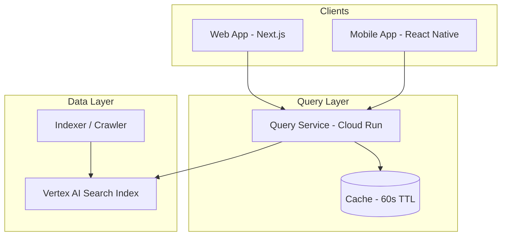
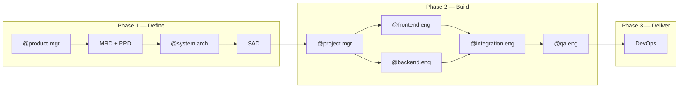

# QuickPickr

**One search. Four apps. Best price.**

QuickPickr is a quick-commerce price comparison product for shoppers in India. Enter a product name and pincode once, compare live prices across **Blinkit**, **Zepto**, **BigBasket**, and **Swiggy Instamart**, and jump to the cheapest retailer to complete your purchase there.

This repository is built with the [AAMAD](https://pypi.org/project/aamad/) (AI-Assisted Multi-Agent Application Development) framework. Phase 1 requirements and solution architecture are complete; application scaffolding begins with `@project.mgr` `*setup-project`.

---

## Table of Contents

- [Project Overview](#project-overview)
- [Problem Statement](#problem-statement)
- [Value Proposition](#value-proposition)
- [Key Features](#key-features)
- [Application Architecture](#application-architecture)
- [Development Workflow (AAMAD Agents)](#development-workflow-aamad-agents)
- [Getting Started](#getting-started)
- [Project Structure](#project-structure)
- [Documentation](#documentation)
- [Next Steps for Contributors](#next-steps-for-contributors)
- [License](#license)

---

## Project Overview

Indian quick-commerce shoppers routinely use multiple apps for groceries and household essentials. The same SKU can differ by **10–40%** between platforms on any given day, but finding the best price means opening **four separate apps**, searching each one, and comparing manually—a **2–5 minute** ritual per item.

QuickPickr replaces that workflow with a single search:

1. Enter a product (e.g. `Amul Gold 500 ml`) and your **6-digit pincode**.
2. View a **price-ranked table** for all four retailers.
3. Tap **Buy on [Retailer]** to open that retailer’s product page and checkout on their platform.

**Technical approach (MVP):** A [Vertex AI Search](https://cloud.google.com/generative-ai-app-builder/docs/enterprise-search-introduction) index over retailer catalog pages, a stateless query API that parses INR prices from search results, and web (Next.js) plus mobile (React Native) clients.

| Attribute | Detail |
|-----------|--------|
| **Target users** | Urban India shoppers using 2+ quick-commerce apps |
| **Retailers (v1)** | Blinkit, Zepto, BigBasket, Swiggy Instamart |
| **Monetization (future)** | Affiliate links, clearly labeled sponsored rows |
| **Status** | Define phase complete — [PRD](project-context/1.define/prd.md) v1.1 |
| **Primary persona** | Priya — Bengaluru professional, price-sensitive on staples |

---

## Problem Statement

**Today:** To find the cheapest price for one item, a shopper opens Blinkit, Zepto, BigBasket, and Instamart, repeats the same search in each app, scrolls past sponsored results, normalizes pack sizes mentally, and switches between apps to compare. Most people stop after one or two apps and pay an unobserved premium.

**Job to be done:** *When I need to buy a known grocery item, help me find the cheapest price across the apps I already use, in under a minute, without making me leave the retailer’s checkout I trust.*

---

## Value Proposition

| For shoppers | For the ecosystem |
|--------------|-------------------|
| **~30 seconds** instead of a multi-app hunt | Discovery layer—no inventory, cart, or payments |
| **One ranked table**—cheapest option is obvious | Checkout and trust stay with retailers |
| **Honest comparison**—freshness timestamps, “closest match” labels | Repeatable daily use on high-frequency staples |
| **No account required** in v1 | Built for trust (see [User Trust Risk](project-context/1.define/prd.md#6-user-trust-risk) in PRD) |

QuickPickr does **not** process payments or hold inventory. It is a **discovery and comparison** product that sends shoppers to the retailer they choose.

---

## Key Features

### MVP (v1 — in scope)

| Feature | Description |
|---------|-------------|
| **Unified search** | Product name + pincode → prices from four retailers in one table |
| **Price-ranked results** | Sorted ascending by INR price; “Lowest price” label on cheapest row |
| **Retailer deep links** | One-tap **Buy on [Retailer]** opens the product detail page |
| **Complete coverage UI** | All four retailer slots shown (available, unavailable, or error) |
| **Like-for-like display** | Product title, pack size, unit price (₹/ml or ₹/g where possible) |
| **Price freshness** | “Updated N min ago”; stale rows labeled when index age >5 min |
| **Match confidence** | “Closest match” badge when SKU equivalence is uncertain |
| **Local pincode memory** | Pincode cached on device—no login required |
| **Trust transparency** | Footer copy: prices sourced from retailer websites |
| **Progressive loading** | Skeleton UI within 200ms; partial results if one retailer is slow |

### Planned (v1.1+)

| Feature | Priority |
|---------|----------|
| GPS → pincode (“Use my location”) | P1 |
| Search history (last 20 queries) | P1 |
| Hindi UI | P1 |
| Native app deep links (iOS/Android) | P1 |

### Explicitly out of scope (v1)

- In-app checkout, cart, or payments  
- Multi-retailer basket optimization  
- User accounts / login  
- Retailers beyond the four named platforms  

Full requirements: [project-context/1.define/prd.md](project-context/1.define/prd.md)

---

## Application Architecture

QuickPickr has three logical layers. Full specification: [project-context/2.build/sad.md](project-context/2.build/sad.md).



### Layer responsibilities

| Layer | Components | Role |
|-------|------------|------|
| **Client** | Next.js (web), React Native (iOS/Android) | Input validation, pincode cache, results UI, deep links, analytics |
| **Query API** | FastAPI on Cloud Run | `POST /v1/search` — parallel Vertex AI Search per retailer, INR parsing, rank by price |
| **Indexing** | Crawler + Vertex AI Search | Index retailer catalog pages; refresh hot SKUs every 2–5 minutes |

### Search flow

1. Client sends `{ query, pincode }` to the query API.  
2. API checks a 60-second cache, then issues **four parallel** Vertex AI Search queries (one per retailer), scoped by serviceability zone.  
3. API parses prices from structured fields and snippets (regex fallback for `₹` amounts).  
4. API returns JSON sorted by `finalPriceInr` ascending.  
5. Client renders the table; user taps through to the retailer PDP.

### API contract (MVP)

```http
POST /v1/search
Content-Type: application/json

{
  "query": "Amul Gold 500 ml",
  "pincode": "560034"
}
```

See [PRD §12](project-context/1.define/prd.md#12-api-contract-mvp) for the full response schema.

### Performance targets

| Metric | Target |
|--------|--------|
| P50 latency (submit → first result) | <1.5s |
| P95 latency | <3.0s |
| Price freshness | ≤5 min for 95% of rows |
| API uptime | 99.5% monthly |

---

## Development Workflow (AAMAD Agents)

QuickPickr is developed using **AAMAD persona agents** in Cursor (or compatible IDEs). Each agent owns a phase or epic and writes auditable artifacts under `project-context/`.



### Agent personas and roles

| Agent | Phase | Role | Primary output |
|-------|-------|------|----------------|
| **@product-mgr** | Define | Market research, MRD, PRD, context handoff | `project-context/1.define/mrd.md`, `prd.md` |
| **@system.arch** | Define | Solution architecture, NFRs, technical decisions | `project-context/1.define/sad.md` |
| **@project.mgr** | Build | Scaffold repo, dependencies, environment | `project-context/2.build/setup.md` |
| **@frontend.eng** | Build | Web/mobile UI, search and results screens | `project-context/2.build/frontend.md` |
| **@backend.eng** | Build | Query API, Vertex AI Search integration, indexer | `project-context/2.build/backend.md` |
| **@integration.eng** | Build | Wire clients to API, end-to-end flows | `project-context/2.build/integration.md` |
| **@qa.eng** | Build | Smoke tests, golden-set validation, trust ACs | `project-context/2.build/qa.md` |

Invoke agents in Cursor chat with `@product-mgr`, `@backend.eng`, etc. See [AGENTS.md](AGENTS.md) and [.cursor/agents/](.cursor/agents/) for full persona definitions.

### Phase 2 epics

| Epic | Persona | Command | Artifact |
|------|---------|---------|----------|
| Setup | @project.mgr | `*setup-project` | `setup.md` |
| Frontend | @frontend.eng | `*develop-fe` | `frontend.md` |
| Backend | @backend.eng | `*develop-be` | `backend.md` |
| Integration | @integration.eng | `*integrate-api` | `integration.md` |
| QA | @qa.eng | `*qa` | `qa.md` |

### Runtime adapter

Set the backend runtime for the generated MVP:

```bash
# One of: crewai (default) | claude-agent-sdk | cursor-sdk
export AAMAD_TARGET_RUNTIME=cursor-sdk
```

Adapter rules live in `.cursor/rules/adapter-*.mdc`. The **search/index path** uses Vertex AI Search on GCP regardless of adapter choice.

---

## Getting Started

### Prerequisites

| Tool | Purpose |
|------|---------|
| [Cursor](https://cursor.com/) (recommended) or VS Code + Copilot | AAMAD agent workflows |
| [Node.js](https://nodejs.org/) LTS | Web app and query API (Phase 2) |
| [Google Cloud](https://cloud.google.com/) account | Vertex AI Search, Cloud Run (Phase 2) |
| Git | Version control |

Optional: `pip install aamad` if re-initializing framework files in a new clone.

### 1. Clone the repository

```bash
git clone <repository-url>
cd quick-pickr-project
```

### 2. Read the requirements

```bash
# Market and product context
project-context/1.define/mrd.md    # Market requirements, personas, trust risks
project-context/1.define/prd.md    # Functional specs, API, acceptance criteria
project-context/1.define/context-summary.md
```

### 3. Use AAMAD in Cursor

1. Open the project in Cursor.  
2. Start a new agent chat and invoke the relevant persona (e.g. `@system.arch`).  
3. Follow [CHECKLIST.md](CHECKLIST.md) for phase order.  
4. Reference files with `@project-context/1.define/prd.md` in prompts.

### 4. Environment variables (Phase 2 — when scaffolded)

A `.env.example` will be added during `*setup-project`. Expected variables include:

```bash
# Google Cloud / Vertex AI Search
GOOGLE_CLOUD_PROJECT=
VERTEX_AI_SEARCH_DATA_STORE_ID=
# Optional: application runtime
AAMAD_TARGET_RUNTIME=cursor-sdk
```

Do not commit secrets. See `setup.md` after the setup epic completes.

### 5. Run Vertex search locally (available now)

If your repo-root `.env` has `VERTEX_SEARCH_SERVING_CONFIG` and `GOOGLE_APPLICATION_CREDENTIALS` set:

```powershell
cd c:\Users\welcome\Documents\quick-pickr-project
python -m venv .venv
.\.venv\Scripts\activate
pip install -r apps\query-service\requirements.txt
python scripts\verify_vertex.py "Amul Gold 500 ml"

cd apps\query-service
$env:PYTHONPATH = "."
uvicorn app.main:app --reload --port 8080
```

Open **http://127.0.0.1:8080/** for the dev search UI, or `POST /v1/search`. See [project-context/2.build/setup.md](project-context/2.build/setup.md).

**Web + mobile clients** are in `apps/web` and `apps/mobile`. See [frontend-plan.md](project-context/2.build/frontend-plan.md) and [frontend.md](project-context/2.build/frontend.md).

```powershell
npm install
copy apps\web\.env.local.example apps\web\.env.local
# Edit NEXT_PUBLIC_API_URL=http://127.0.0.1:8080
npm run dev:web
```

---

## Project Structure

```
quick-pickr-project/
├── README.md                 # This file — QuickPickr project overview
├── AGENTS.md                 # AAMAD agent index
├── CHECKLIST.md              # Define → Build → Deliver checklist
│
├── project-context/          # Auditable artifacts (IDE-agnostic)
│   ├── 1.define/             # Phase 1 — requirements (complete)
│   │   ├── mrd.md            # Market Requirements Document
│   │   ├── prd.md            # Product Requirements Document
│   │   └── context-summary.md
│   ├── 2.build/              # Phase 2 — architecture + implementation docs
│   │   ├── sad.md            # Solution Architecture Document
│   │   ├── architecture-plan.md
│   │   ├── setup.md          # (after *setup-project)
│   │   ├── frontend.md
│   │   ├── backend.md
│   │   ├── integration.md
│   │   └── qa.md
│   └── 3.deliver/            # Phase 3 — deployment (future)
│
├── .cursor/                  # Cursor / AAMAD framework
│   ├── agents/               # Persona definitions (@product-mgr, etc.)
│   ├── rules/                # Always-on rules and runtime adapters
│   ├── templates/            # MRD, PRD, SAD templates
│   └── prompts/              # Phase-specific prompts
│
├── QuickPickr_MRD.md         # Pointer → project-context/1.define/mrd.md
└── QuickPickr_PRD.md         # Pointer → project-context/1.define/prd.md
```

**Note:** `web/`, `api/`, and `mobile/` directories will appear after Phase 2 setup. Current repo state is **requirements-only**.

---

## Documentation

| Document | Description |
|----------|-------------|
| [MRD](project-context/1.define/mrd.md) | Market opportunity, personas, structured user stories, user trust risk |
| [PRD](project-context/1.define/prd.md) | Features, NFRs, API contract, acceptance criteria, release plan |
| [Context summary](project-context/1.define/context-summary.md) | Phase 1 handoff for architects and builders |
| [SAD](project-context/2.build/sad.md) | Solution architecture (FastAPI, Vertex AI Search, clients) |
| [Architecture plan](project-context/2.build/architecture-plan.md) | Milestones, SLOs, implementation status |
| [CHECKLIST.md](CHECKLIST.md) | Step-by-step AAMAD execution |
| [AGENTS.md](AGENTS.md) | Agent persona quick reference |

---

## Next Steps for Contributors

### If you are new to the project

1. Read the [PRD](project-context/1.define/prd.md) executive summary and [User Trust Risk](project-context/1.define/prd.md#6-user-trust-risk) section—accuracy and deep links are release blockers.  
2. Review [structured user stories](project-context/1.define/prd.md#5-user-stories-structured-format) (US-001–US-013).  
3. Check [CHECKLIST.md](CHECKLIST.md) for current phase status.

### Recommended build sequence

| Step | Owner | Action | Output |
|------|-------|--------|--------|
| 1 | @system.arch | SAD + architecture plan | [sad.md](project-context/2.build/sad.md), [architecture-plan.md](project-context/2.build/architecture-plan.md) |
| 2 | @project.mgr | `*setup-project` | Repo scaffold, `.env.example`, `setup.md` |
| 4 | @backend.eng | `*develop-be` | Query API, Vertex AI Search, indexer |
| 5 | @frontend.eng | `*develop-fe` | Next.js + React Native search UI |
| 6 | @integration.eng | `*integrate-api` | End-to-end search → click-out |
| 7 | @qa.eng | `*qa` | Golden-set tests (e.g. `Amul Gold 500 ml` + `560034`) |

### How to contribute

- **Requirements:** Open issues or PRs against `project-context/1.define/` with clear traceability to story IDs (e.g. US-007, UTR-01).  
- **Code (Phase 2+):** Follow the epic owned by your persona; document decisions in the matching `project-context/2.build/*.md` artifact.  
- **Trust and quality:** Do not merge changes that weaken freshness labels, SKU match conservatism, or four-retailer completeness without PM sign-off.  
- **Modules:** Use a **fresh Cursor chat per epic** (see `.cursor/rules/development-workflow.mdc`) to keep context bounded.

### Open questions (need resolution before or during build)

| Topic | Default if unresolved |
|-------|---------------------|
| Stale price UX (>5 min) | Show row with “Price may be outdated” |
| Delivery time in ranking | Price only in v1 |
| Multi-item basket | Deferred to v2 |

See [PRD Open Questions](project-context/1.define/prd.md#open-questions).

---

## License

Licensed under the Apache License 2.0 (per AAMAD framework defaults).

---

> **QuickPickr** — Compare quick-commerce prices in India without opening four apps.  
> Built with **AAMAD** for auditable, multi-agent development.
