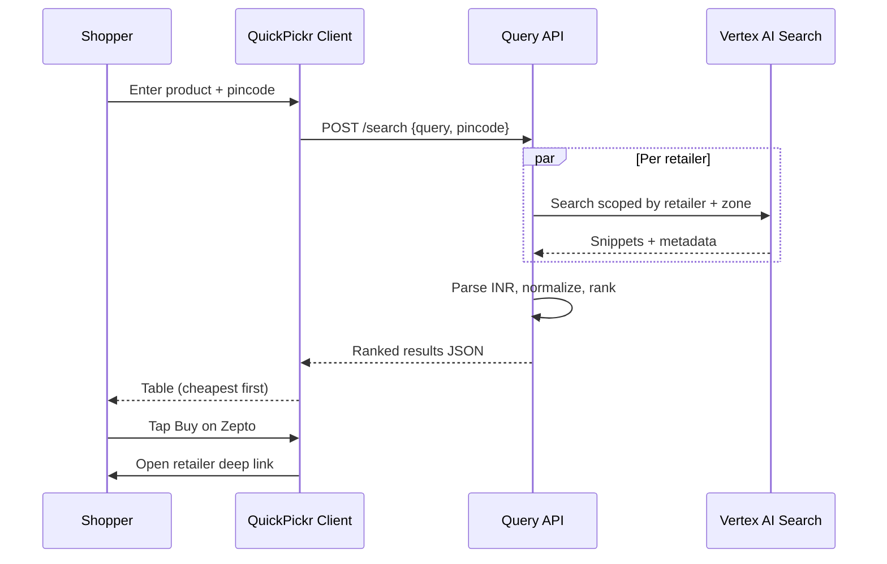
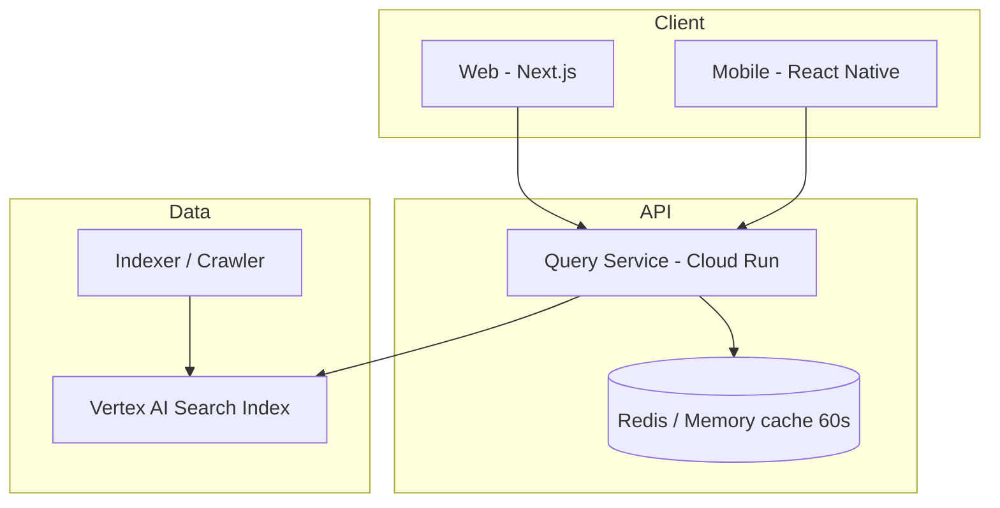

# QuickPickr — Product Requirements Document (PRD)

| Field | Value |
|-------|-------|
| **Product** | QuickPickr — Quick-Commerce Price Comparison (India) |
| **Version** | 1.1 |
| **Date** | 2026-05-19 |
| **Author** | @product-mgr |
| **Status** | Draft for engineering and design review |
| **Related** | [mrd.md](./mrd.md), [context-summary.md](./context-summary.md) |
| **Runtime note** | MVP implementation may use `cursor-sdk`, `crewai`, or `claude-agent-sdk` per `AAMAD_TARGET_RUNTIME`; search/index layer is Vertex AI Search on GCP |

---

## 1. Executive Summary

QuickPickr lets an Indian shopper enter a **product name** (e.g., `Amul Gold 500 ml`) and a **six-digit pincode**, then receive a **single table ranked by price** across **Blinkit**, **Zepto**, **BigBasket**, and **Swiggy Instamart**, with **deep links** to each retailer’s product page. The shopper completes purchase on the retailer’s own platform.

**Technical core (MVP):** A **Vertex AI Search** index over the four retailer websites → query API parses **INR prices** from snippets/structured fields → client renders ranked results.

**Success:** P50 search-to-first-result **<1.5s**; P95 **<3s**; price freshness **≤5 minutes** for **≥95%** of rows; **≥3 of 4** retailers on top-500 SKUs in launch cities.

---

## 2. Product Vision and Principles

### 2.1 Vision

Be the default **first search** before opening any quick-commerce app—like Google for web, but for “who has the cheapest [staple] at my pincode.”

### 2.2 Design principles

| Principle | Implementation |
|-----------|----------------|
| **Neutral** | Sort by transparent rules (price ascending in v1) |
| **Honest** | Freshness timestamps; “closest match” when uncertain |
| **Fast** | Progressive results if one retailer is slow |
| **Lightweight** | No account in v1 |
| **Retailer-respectful** | Clear logos, attribution, outbound CTAs |

---

## 3. Goals and Non-Goals

### 3.1 Goals (v1)

| ID | Goal |
|----|------|
| G1 | One search returns comparable prices from four retailers for a given pincode |
| G2 | Results ranked by final displayed INR price (ascending) |
| G3 | One tap opens the correct retailer product page (deep link or HTTPS) |
| G4 | Graceful degradation when 1–3 retailers fail or lack SKU |
| G5 | Pincode remembered locally after first entry |

### 3.2 Non-goals (v1)

| ID | Non-goal |
|----|----------|
| NG1 | Payments, cart, checkout, returns |
| NG2 | Multi-item basket optimization |
| NG3 | User accounts / login |
| NG4 | Editorial “best buy” beyond price rank |
| NG5 | Personalization of rank order |
| NG6 | Retailers beyond the four named platforms |

---

## 4. User Personas

See [mrd.md §3](./mrd.md#3-target-users-and-personas). Primary design target: **Priya** (Bengaluru, multi-app, staple price sensitivity).

---

## 5. User Stories (Structured Format)

Stories trace to [mrd.md §4](./mrd.md#4-user-stories-structured-format). Each story includes engineering-ready acceptance criteria and links to functional requirements.

### 5.0 Story schema

| Field | Description |
|-------|-------------|
| **ID** | US-### (PRD); maps to US-MRD-### where applicable |
| **Epic** | E1–E5 capability group |
| **Persona** | Priya \| Rohan \| Meera \| All |
| **Story** | As a / I want / So that |
| **Acceptance criteria** | Testable Given/When/Then or numbered outcomes |
| **Priority** | P0 \| P1 \| P2 |
| **FR refs** | Linked functional requirements |
| **Trust risk refs** | Linked UTR IDs from §6 |

---

### US-001 — Multi-app price table

| Field | Value |
|-------|-------|
| **ID** | US-001 |
| **MRD trace** | US-MRD-001 |
| **Epic** | E1 — Search and compare |
| **Persona** | Priya |
| **Story** | **As a** price-conscious shopper, **I want to** search by product name and pincode and see prices from Blinkit, Zepto, BigBasket, and Instamart in one table, **so that** I avoid opening four apps. |
| **Acceptance criteria** | **Given** valid pincode and query ≥2 chars, **When** I submit, **Then** I see up to four retailer rows within P95 3s. **Given** a successful index response, **When** results render, **Then** each row shows retailer logo, title, pack size, and INR price. |
| **Priority** | P0 |
| **FR refs** | FR-1.1–1.5, FR-2.1, FR-3.1–3.2 |
| **Trust risk refs** | UTR-03, UTR-08 |

---

### US-002 — Cheapest-first ranking

| Field | Value |
|-------|-------|
| **ID** | US-002 |
| **MRD trace** | US-MRD-002 |
| **Epic** | E1 — Search and compare |
| **Persona** | Priya, Rohan |
| **Story** | **As a** shopper, **I want** results sorted from lowest to highest price, **so that** the best deal is immediately obvious. |
| **Acceptance criteria** | **Given** ≥2 available rows, **When** table renders, **Then** rows are ordered ascending by `finalPriceInr`. **Given** a cheapest row exists, **When** I view results, **Then** row #1 displays text label “Lowest price” (accessible, not color-only). |
| **Priority** | P0 |
| **FR refs** | FR-3.1, FR-3.5 |
| **Trust risk refs** | UTR-01, UTR-09 |

---

### US-003 — Unavailable retailers visible

| Field | Value |
|-------|-------|
| **ID** | US-003 |
| **MRD trace** | US-MRD-004 |
| **Epic** | E1 — Search and compare |
| **Persona** | Rohan |
| **Story** | **As a** shopper, **I want to** see when a retailer does not have the product at my pincode, **so that** I trust the search was complete. |
| **Acceptance criteria** | **Given** a retailer returns no match, **When** results render, **Then** that retailer’s row shows “Not available at your pincode” and CTA is disabled. **Given** any search, **When** complete, **Then** exactly four retailer slots are represented (available, unavailable, or error). |
| **Priority** | P0 |
| **FR refs** | FR-3.3 |
| **Trust risk refs** | UTR-03 |

---

### US-004 — Like-for-like product display

| Field | Value |
|-------|-------|
| **ID** | US-004 |
| **MRD trace** | US-MRD-005 |
| **Epic** | E1 — Search and compare |
| **Persona** | Priya, Meera |
| **Story** | **As a** shopper, **I want** product title and pack size on every row, **so that** I compare the same SKU across apps. |
| **Acceptance criteria** | **Given** any available row, **When** displayed, **Then** `title` and `packSize` are non-empty. **Given** `matchConfidence: low`, **When** displayed, **Then** “Closest match” badge is visible adjacent to title. |
| **Priority** | P0 |
| **FR refs** | FR-3.2, FR-6.1–6.3 |
| **Trust risk refs** | UTR-02 |

---

### US-005 — One-tap buy on retailer

| Field | Value |
|-------|-------|
| **ID** | US-005 |
| **MRD trace** | US-MRD-003 |
| **Epic** | E2 — Buy on retailer |
| **Persona** | All |
| **Story** | **As a** shopper, **I want to** tap “Buy on [Retailer]” and open that product’s page, **so that** I can complete purchase without searching again. |
| **Acceptance criteria** | **Given** an available row, **When** I tap CTA, **Then** device opens retailer PDP URL or app deep link. **Given** golden-set SKUs, **When** tested on iOS and Android, **Then** 100% land on correct PDP (AC-4). **Given** tap, **When** navigating, **Then** optional affiliate tag is appended only when configured. |
| **Priority** | P0 |
| **FR refs** | FR-4.1–4.4 |
| **Trust risk refs** | UTR-04, UTR-05, UTR-06 |

---

### US-006 — Open retailer native app (P1)

| Field | Value |
|-------|-------|
| **ID** | US-006 |
| **Epic** | E2 — Buy on retailer |
| **Persona** | Rohan |
| **Story** | **As a** mobile shopper, **I want** the buy link to open the installed retailer app when possible, **so that** I stay in my familiar checkout flow. |
| **Acceptance criteria** | **Given** retailer app installed, **When** I tap CTA, **Then** app opens to PDP via deep link. **Given** app not installed, **When** I tap CTA, **Then** HTTPS product page opens in browser. |
| **Priority** | P1 |
| **FR refs** | FR-4.2, FR-11 |
| **Trust risk refs** | UTR-04 |

---

### US-007 — Price freshness visible

| Field | Value |
|-------|-------|
| **ID** | US-007 |
| **MRD trace** | US-MRD-006 |
| **Epic** | E3 — Trust and clarity |
| **Persona** | Priya |
| **Story** | **As a** shopper, **I want to** see when each price was last updated, **so that** I can judge whether to trust it before switching apps. |
| **Acceptance criteria** | **Given** any price row, **When** displayed, **Then** freshness text is shown (e.g., “Updated 2 min ago”) from `crawledAt`. **Given** age >5 min, **When** displayed, **Then** row shows “Price may be outdated” per stale policy. **Given** production traffic, **When** measured, **Then** ≥95% of rows are ≤5 min old. |
| **Priority** | P0 |
| **FR refs** | FR-3.6, NFR 8.3 |
| **Trust risk refs** | UTR-01, UTR-05 |

---

### US-008 — Ambiguous query labeling

| Field | Value |
|-------|-------|
| **ID** | US-008 |
| **Epic** | E3 — Trust and clarity |
| **Persona** | All |
| **Story** | **As a** shopper searching broadly (e.g., “milk”), **I want** uncertain matches clearly labeled, **so that** I do not assume an exact SKU match. |
| **Acceptance criteria** | **Given** query `milk`, **When** results return, **Then** rows with low confidence show “Closest match”. **Given** confidence below threshold, **When** no safe match exists, **Then** retailer row is omitted or marked unavailable—not shown as exact match. |
| **Priority** | P0 |
| **FR refs** | FR-6.1–6.3 |
| **Trust risk refs** | UTR-02 |

---

### US-009 — Remember pincode locally

| Field | Value |
|-------|-------|
| **ID** | US-009 |
| **MRD trace** | US-MRD-007 |
| **Epic** | E4 — Convenience |
| **Persona** | Priya, Meera |
| **Story** | **As a** returning shopper, **I want** my pincode prefilled, **so that** repeat searches are faster. |
| **Acceptance criteria** | **Given** I entered pincode 110001 on first launch, **When** I reopen the app, **Then** pincode field is prefilled with 110001. **Given** prefilled pincode, **When** I change it and search, **Then** new pincode is saved locally. **Given** v1, **When** using app, **Then** no account or server-side pincode storage is required. |
| **Priority** | P0 |
| **FR refs** | FR-5.1–5.2 |
| **Trust risk refs** | UTR-07 |

---

### US-010 — Use location for pincode (P1)

| Field | Value |
|-------|-------|
| **ID** | US-010 |
| **Epic** | E4 — Convenience |
| **Persona** | Rohan |
| **Story** | **As a** shopper, **I want to** use my location to fill pincode, **so that** I do not look up my pincode manually. |
| **Acceptance criteria** | **Given** location permission granted, **When** I tap “Use my location”, **Then** pincode is derived via reverse geocode and editable before submit. **Given** permission denied, **When** I tap, **Then** inline message explains manual entry—no crash. |
| **Priority** | P1 |
| **FR refs** | FR-7 |
| **Trust risk refs** | UTR-07 |

---

### US-011 — Search history (P1)

| Field | Value |
|-------|-------|
| **ID** | US-011 |
| **MRD trace** | US-MRD-009 |
| **Epic** | E4 — Convenience |
| **Persona** | Meera |
| **Story** | **As a** frequent shopper, **I want to** re-run recent searches, **so that** I can re-check weekly staple prices quickly. |
| **Acceptance criteria** | **Given** prior searches, **When** I open history, **Then** last 20 queries are listed locally. **Given** a history item, **When** I tap it, **Then** search runs with current index data and cached pincode. |
| **Priority** | P1 |
| **FR refs** | FR-8 |
| **Trust risk refs** | — |

---

### US-012 — Hindi UI (P1)

| Field | Value |
|-------|-------|
| **ID** | US-012 |
| **Epic** | E3 — Trust and clarity |
| **Persona** | All |
| **Story** | **As a** Hindi-preferring shopper, **I want** the app UI in Hindi, **so that** I can use QuickPickr comfortably. |
| **Acceptance criteria** | **Given** Hindi selected in settings, **When** I view core screens, **Then** labels and CTAs render in Hindi. **Given** Hindi UI, **When** I type a Devanagari product query, **Then** search executes without forced transliteration. |
| **Priority** | P1 |
| **FR refs** | FR-10, NFR 8.6 |
| **Trust risk refs** | UTR-10 |

---

### US-013 — Understand data source (trust)

| Field | Value |
|-------|-------|
| **ID** | US-013 |
| **Epic** | E5 — Transparency |
| **Persona** | All |
| **Story** | **As a** first-time user, **I want to** understand where prices come from, **so that** I trust QuickPickr is not making up numbers. |
| **Acceptance criteria** | **Given** any results or empty state, **When** I view footer/help, **Then** copy states prices are sourced from retailer websites and may differ at checkout. **Given** v1, **When** I view results, **Then** no sponsored rows appear without “Sponsored” label. |
| **Priority** | P0 |
| **FR refs** | §10.1 footer; FR-3 (attribution) |
| **Trust risk refs** | UTR-05, UTR-06, UTR-08 |

---

### 5.1 Epic index

| Epic | Stories | P0 |
|------|---------|-----|
| E1 — Search and compare | US-001–004 | 4 |
| E2 — Buy on retailer | US-005–006 | 1 |
| E3 — Trust and clarity | US-007, 008, 012 | 2 |
| E4 — Convenience | US-009–011 | 1 |
| E5 — Transparency | US-013 | 1 |

---

## 6. User Trust Risk

User trust risks are product requirements—not only market concerns. See [mrd.md §5](./mrd.md#5-user-trust-risk) for market framing. Engineering, design, and QA must treat **UTR-01, UTR-02, and UTR-04** as release blockers if golden-set thresholds fail.

### 6.1 Trust risk register (product)

| ID | User trust risk | User-visible symptom | Product requirement | Owner | Release gate |
|----|-----------------|----------------------|---------------------|-------|--------------|
| **UTR-01** | Stale or wrong “lowest” price | User pays more on retailer PDP | FR-3.6 freshness; NFR ≤5 min / 95%; stale label; click-out disclaimer | Backend + FE | AC-2; golden set ≥98% accuracy |
| **UTR-02** | Wrong SKU compared | User buys unintended pack/brand | FR-6.x match confidence; suppress low-confidence rows | Backend | AC-5; false match <2% |
| **UTR-03** | Incomplete search perceived | User re-opens apps “just in case” | FR-3.3 four-row model; unavailable copy | FE | US-003 acceptance |
| **UTR-04** | Broken or misleading deep link | User blames QuickPickr; abandons | FR-4.x; golden-set PDP tests | FE + QA | AC-4 100% on golden set |
| **UTR-05** | Checkout price ≠ shown price | “App lied to me” | Footer + CTA: “Confirm price on [Retailer]”; no guarantee language | PM + FE | US-013; copy review |
| **UTR-06** | Perceived pay-to-rank bias | Distrust of sort order | v1: zero sponsored in organic table; future: fixed slot + label | PM | No sponsor in M2 without legal review |
| **UTR-07** | Privacy anxiety (pincode/location) | User refuses install | Local-only pincode; permission rationale; DPDP notice | FE + Legal | Privacy policy linked |
| **UTR-08** | Unknown brand / scam fear | User bounces before first search | Retailer logos; “Prices from retailer sites”; no fake countdowns | Design | Usability test ≥4/5 trust |
| **UTR-09** | Hidden delivery/handling fees | Cheapest row not cheapest delivered | Unit price; “+ delivery” when unknown; OQ-1/OQ-3 | PM | Document in FAQ |
| **UTR-10** | Hindi / mixed-script search fails | Non-English users churn | FR-1.2 input; Hindi UI P1; monitor zero-result by script | Backend | Script-specific QA set |

### 6.2 Trust-related UI copy (required)

| Surface | Copy (English; Hindi P1) |
|---------|--------------------------|
| Results footer | “Prices sourced from Blinkit, Zepto, BigBasket, and Swiggy Instamart websites. Confirm final price at checkout.” |
| Pre–click-out (optional modal/tooltip) | “Price may have changed. You’ll complete your order on [Retailer].” |
| Stale row | “Price may be outdated — check on [Retailer]” |
| Closest match | “Closest match — verify pack size before buying” |
| Empty state | “We couldn’t find this item. Try a more specific name (brand + size).” |

### 6.3 Trust test cases (add to §12)

| ID | Given | When | Then |
|----|-------|------|------|
| AC-T1 | Any results view | Page loads | Footer trust copy visible without scroll on mobile |
| AC-T2 | Row age >5 min | Render | Stale warning shown (OQ-3 default) |
| AC-T3 | `matchConfidence: low` | Render | “Closest match” visible; AC-5 passes |
| AC-T4 | User taps Buy CTA | Navigate | Disclaimer available within 1 tap (footer or inline) |
| AC-T5 | v1 production build | Audit results table | No sponsored row without “Sponsored” label |

### 6.4 Trust instrumentation

| Event | Properties | Use |
|-------|------------|-----|
| `trust_feedback` | sessionId, rating 1–5, optional comment | Beta survey in app |
| `price_mismatch_report` | sessionId, retailer, query, expected vs seen | Post-click-out feedback link (P1) |
| `stale_row_shown` | retailer, ageMinutes | Monitor UTR-01 |

### 6.5 Story ↔ trust risk matrix

| Story | Primary UTR risks |
|-------|-------------------|
| US-001, US-002 | UTR-01, 03, 08, 09 |
| US-004, US-008 | UTR-02, 10 |
| US-005, US-006 | UTR-04, 05, 06 |
| US-007, US-013 | UTR-01, 05, 08 |
| US-009, US-010 | UTR-07 |

---

## 7. User Journeys

### 7.1 Happy path — single SKU



### 7.2 Edge paths

| Scenario | Expected behavior |
|----------|-------------------|
| One retailer timeout | Show other three; row = “Temporarily unavailable” |
| Zero retailers match | Empty state + search tips (refine query, check pincode) |
| Ambiguous query (“milk”) | Results with `matchConfidence: low` + “Closest match” badge |
| Invalid pincode | Inline validation before submit |
| Offline client | Cached pincode only; search disabled with message |

---

## 8. Functional Requirements

### 8.1 P0 — Must ship

#### FR-1 Search input

| Req | Detail |
|-----|--------|
| FR-1.1 | Free-text product field; min 2 chars; max 120 chars |
| FR-1.2 | Accept English, Hindi (Devanagari), and transliterated mixed input |
| FR-1.3 | Pincode field: exactly 6 digits; Indian pincode validation (first digit 1–9) |
| FR-1.4 | Submit via button and Enter/Return key |
| FR-1.5 | Disable submit while in-flight; prevent duplicate concurrent searches |

#### FR-2 Loading and progressive display

| Req | Detail |
|-----|--------|
| FR-2.1 | Skeleton table within **200ms** of submit |
| FR-2.2 | If full response >3s, render rows as each retailer resolves |
| FR-2.3 | Show global spinner only until first row or terminal empty state |

#### FR-3 Results table

| Req | Detail |
|-----|--------|
| FR-3.1 | One row per retailer (4 rows max); sort **ascending by `finalPriceInr`** |
| FR-3.2 | Columns: retailer logo, product image, title, pack size, unit price (₹/g or ₹/ml when computable), **final price INR**, freshness, CTA |
| FR-3.3 | `finalPriceInr` = listed product price; include `deliveryFeeInr` in total only when reliably known; otherwise footnote “+ delivery” |
| FR-3.4 | Unavailable: row visible with copy **“Not available at your pincode”** (not hidden) |
| FR-3.5 | Cheapest row: text label **“Lowest price”** (not color-only) |
| FR-3.6 | Freshness: human-readable e.g. `Updated 2 min ago` from `crawledAt` |

#### FR-4 Outbound links

| Req | Detail |
|-----|--------|
| FR-4.1 | CTA label: `Buy on {RetailerName}` |
| FR-4.2 | Prefer retailer app deep link; fallback HTTPS product URL |
| FR-4.3 | Append affiliate tag query param when configured per retailer |
| FR-4.4 | Open in default browser / app (platform standard) |

#### FR-5 Pincode persistence

| Req | Detail |
|-----|--------|
| FR-5.1 | Store last valid pincode in device local storage |
| FR-5.2 | Prefill on next launch; user can edit before search |

#### FR-6 Match quality

| Req | Detail |
|-----|--------|
| FR-6.1 | `matchConfidence`: `high` \| `low` per row |
| FR-6.2 | If `low`, show **“Closest match”** adjacent to title |
| FR-6.3 | Prefer **no row** over wrong-SKU row when confidence below threshold |

### 8.2 P1 — Should ship (v1.1 if slipped)

| ID | Requirement |
|----|-------------|
| FR-7 | GPS → reverse geocode → pincode with permission prompt |
| FR-8 | Search history: last 20 queries, one-tap re-search |
| FR-9 | Settings: clear pincode cache and history |
| FR-10 | Hindi UI strings (i18n) |
| FR-11 | Retailer app deep links on iOS and Android |

### 8.3 P2 — Future

| ID | Requirement |
|----|-------------|
| FR-12 | Multi-item basket comparison |
| FR-13 | Price-drop alerts |
| FR-14 | Estimated delivery time in rank |
| FR-15 | User accounts and saved lists |
| FR-16 | Additional retailers |

---

## 9. Non-Functional Requirements

### 9.1 Performance

| Metric | Target |
|--------|--------|
| P50 end-to-end (submit → first row) | <1.5s |
| P95 end-to-end | <3.0s |
| P95 Vertex AI Search per retailer | <800ms |
| Client TTI (web, 4G) | <2.5s |

### 9.2 Reliability

| Metric | Target |
|--------|--------|
| API monthly uptime | 99.5% |
| Partial failure | ≥1 retailer row in ≥99% of successful index-backed queries |

### 9.3 Freshness and accuracy

| Metric | Target |
|--------|--------|
| Displayed price age | ≤5 min for 95% of rows |
| Acceptance test accuracy | Within ±2% of live retailer app price at query time |
| False match rate | <2% on golden-set queries (internal QA) |

### 9.4 Security and privacy

- No server-side storage of query history tied to identity in v1.
- Pincode stored **client-local only**.
- Analytics: anonymized `sessionId` (random UUID per install).
- HTTPS only; HSTS on web.
- DPDP-aligned privacy policy linked in footer.

### 9.5 Accessibility

- WCAG 2.1 AA.
- Table navigable by keyboard on web.
- Screen reader announces rank position and price.
- Minimum touch target 44×44 dp on mobile.

### 9.6 Localization

- UI: English (default), Hindi (P1).
- Product query input: any script; no forced translation.

---

## 10. UX and UI Requirements

### 10.1 Screens (v1)

| Screen | Elements |
|--------|----------|
| **Home / Search** | Logo, product input, pincode input, optional “Use location”, search CTA, recent searches (P1) |
| **Results** | Back/edit query, results table, legal footer (data sources, privacy) |
| **Empty** | Illustration, suggestions, edit search |
| **Settings (P1)** | Clear pincode, clear history |

### 10.2 Results row wireframe (logical)

```
[Logo]  [Image]  Title (pack size)
                 ₹XXX  ·  ₹Y/unit  ·  Updated N min ago
                 [Closest match] (optional)
                                    [ Buy on Retailer → ]
```

### 10.3 States per row

| State | UI |
|-------|-----|
| `available` | Full row + CTA enabled |
| `unavailable` | Muted row, no CTA, explanation copy |
| `error` | “Temporarily unavailable” + retry affordance on pull-to-refresh |
| `stale` | Show row with `Price may be outdated` if age >5 min (policy: see Open Questions) |

---

## 11. Technical Architecture

### 11.1 Logical layers



### 11.2 Indexing layer

| Field | Type | Notes |
|-------|------|-------|
| `retailer` | enum | `blinkit`, `zepto`, `bigbasket`, `instamart` |
| `pincode` or `zoneId` | string | Serviceability key |
| `skuId` | string | Retailer-native ID if extractable |
| `title` | string | Product name |
| `packSize` | string | e.g. `500 ml` |
| `imageUrl` | url | CDN image |
| `priceInr` | number | Parsed at index time |
| `productUrl` | url | Canonical PDP link |
| `crawledAt` | ISO8601 | Freshness |

**Refresh policy:**

| Tier | SKUs | Refresh cadence |
|------|------|-----------------|
| Hot | Top 500 national staples | Every 2–5 minutes |
| Warm | Top 10K | Hourly |
| Long tail | Remainder | Daily |

Crawler respects `robots.txt` and rate limits.

### 11.3 Query layer

**Input:** `{ "query": string, "pincode": string }`

**Processing:**

1. Validate pincode and query.
2. Check cache key `hash(query|pincode)` TTL **60s**.
3. Issue **four parallel** Vertex AI Search queries (one per retailer), scoped by pincode/zone.
4. Parse snippets:
   - Primary: structured fields from index
   - Fallback: regex `₹\s?\d+(?:[.,]\d{1,2})?` on snippet text
5. Normalize pack size where possible; compute unit price.
6. Assign `matchConfidence` via rules + optional LLM grounding (deterministic threshold).
7. Sort by `finalPriceInr` ascending; return JSON.

**Idempotency:** Same inputs within cache window return identical response.

### 11.4 Client layer

| Platform | Stack | Notes |
|----------|-------|-------|
| Web | Next.js on CDN/edge | Shared API contract |
| Mobile | React Native | iOS + Android |

Client responsibilities: validation, pincode cache, deep-link builder, analytics events, i18n.

### 11.5 Observability

| Signal | Alert threshold |
|--------|-----------------|
| `parse_failure_rate` per retailer | >5% over 15 min |
| `p95_latency` | >3s over 5 min |
| `zero_result_rate` | >30% over 1 hr |
| `freshness_p95_age` | >10 min |
| GCP spend | Monthly budget 80% |

---

## 12. API Contract (MVP)

### 12.1 `POST /v1/search`

**Request**

```json
{
  "query": "Amul Gold 500 ml",
  "pincode": "560034"
}
```

**Response 200**

```json
{
  "query": "Amul Gold 500 ml",
  "pincode": "560034",
  "searchedAt": "2026-05-19T10:00:00Z",
  "results": [
    {
      "retailer": "zepto",
      "retailerDisplayName": "Zepto",
      "title": "Amul Gold Full Cream Milk",
      "packSize": "500 ml",
      "imageUrl": "https://...",
      "finalPriceInr": 34,
      "unitPriceLabel": "₹0.068/ml",
      "matchConfidence": "high",
      "status": "available",
      "crawledAt": "2026-05-19T09:58:00Z",
      "buyUrl": "https://..."
    }
  ],
  "meta": {
    "cacheHit": false,
    "latencyMs": 1240
  }
}
```

**Errors**

| Code | When |
|------|------|
| 400 | Invalid pincode or query |
| 429 | Rate limit |
| 503 | Upstream search unavailable |

---

## 13. Acceptance Criteria

### 13.1 Golden-path tests

| ID | Given | When | Then |
|----|-------|------|------|
| AC-1 | Pincode 560034 | Search `Amul Gold 500 ml` | ≥3 retailers with `status: available` |
| AC-2 | AC-1 results | Compare to live retailer apps | Prices within ±2% at same timestamp |
| AC-3 | AC-1 | Measure latency over 1000 queries | P95 <3s |
| AC-4 | Cheapest row | Tap CTA on iOS and Android | Correct PDP opens 100% on golden set |
| AC-5 | Query `milk` | Submit | Rows show `matchConfidence: low` and visible label |
| AC-6 | Query `Macallan 18` | Submit | Graceful empty state, HTTP 200 |
| AC-7 | First launch pincode 110001 | Close and reopen app | Pincode prefilled |
| AC-8 | Same query+pincode on web and mobile | Within freshness window | Identical rank order |

### 13.2 Trust acceptance tests

See §6.3 (AC-T1 through AC-T5). Block release if AC-T1, AC-T3, or AC-T5 fail.

### 13.3 Regression suite

- Maintain **golden set** of 50 queries × 5 pincodes in CI staging.
- Block release if AC-1–AC-4 fail on golden set.

---

## 14. Metrics and Instrumentation

### 14.1 Event: `search_completed`

| Property | Type |
|----------|------|
| sessionId | string |
| query | string |
| pincode | string (hashed optional for analytics warehouse) |
| retailersReturned | string[] |
| pricesInr | number[] |
| latencyMs | number |
| cacheHit | boolean |

### 14.2 Event: `retailer_clickout`

| Property | Type |
|----------|------|
| sessionId | string |
| retailer | string |
| rankPosition | number |
| finalPriceInr | number |

### 14.3 Dashboards (weekly review)

- Searches per WAU, CTR by retailer, zero-result rate, parse-failure by retailer, P50/P95 latency, freshness percentile, D1/D7/D30 retention.

---

## 15. Release Plan

| Milestone | Scope | Exit criteria |
|-----------|-------|---------------|
| **M0 — Internal alpha** | API + web only, 1 city index | AC-1, AC-3 on staging |
| **M1 — Closed beta** | Web + Android, 5 cities | AC-1–AC-7 |
| **M2 — Public v1** | + iOS, production index | All P0 FRs, store approval |

---

## 16. Dependencies

| Dependency | Owner | Risk |
|------------|-------|------|
| Google Cloud Vertex AI Search | Eng | API limits, cost |
| Retailer public catalog URLs | Eng/Legal | Structure change |
| App Store / Play review | PM/Eng | Comparison app scrutiny |
| Affiliate programs | BD | Optional at launch |

---

## 17. Technical Risks and Mitigations

| Risk | Mitigation |
|------|------------|
| Parser breakage | Per-retailer monitors; golden-set CI |
| Legal challenge | robots.txt, attribution, partnership track |
| Stale prices | §6 UTR-01; freshness UI; conservative cache TTL |
| Cost overrun | 60s query cache; hot-SKU tiering |
| User trust collapse | §6 User Trust Risk; AC-T1–T5; block release on UTR-01/02/04 |

---

## 18. Traceability Matrix (MRD → PRD)

| MRD section | PRD sections |
|-------------|--------------|
| §4 User Stories | §5 User Stories (US-MRD → US-###) |
| §5 User Trust Risk | §6 User Trust Risk (UTR-###) |
| §6 Problem | §7 Journeys, §8 FR |
| §7 Solution | §1, §11 Architecture |
| §8 Competitive | §3 Non-goals, §8 scope |
| §11 KPIs | §9 NFR, §14 Metrics |
| §13 Business risks | §17 Technical risks |
| §14 Roadmap | §8 P1/P2, §15 Release |

---

## Sources

| # | Source |
|---|--------|
| 1 | [mrd.md](./mrd.md) — market requirements baseline |
| 2 | Stakeholder brief — product + pincode search, Vertex AI Search, INR parsing, ranked table (2026-05-19) |
| 3 | AAMAD PRD template — `.cursor/templates/prd-template.md` (structure) |

---

## Assumptions

1. Vertex AI Search can be partitioned or filtered per retailer and serviceability zone.
2. Snippet parsing achieves acceptable accuracy with regex fallback for MVP.
3. React Native and Next.js share one OpenAPI contract.
4. `AAMAD_TARGET_RUNTIME` governs any optional agentic backend for ops, not the core search path.
5. Delivery fee inclusion is optional in v1 when not present in indexed data.

---

## Open Questions

| # | Question | Owner | Default if unresolved |
|---|----------|-------|------------------------|
| OQ-1 | Include delivery time in rank for v1? | PM | **No** — price only |
| OQ-2 | Multi-item basket at launch? | PM | **No** — v2 |
| OQ-3 | Stale row (>5 min): show with warning or hide? | PM | **Show with warning** |
| OQ-4 | BigBasket quick vs scheduled SKU handling? | PM/Eng | Index quick-delivery offers only |
| OQ-5 | Rate limit per IP/session? | Eng | 30 searches/min |

---

## Audit

| Timestamp (UTC) | Persona | Action |
|-----------------|---------|--------|
| 2026-05-19T00:00:00Z | @product-mgr | Initial comprehensive PRD authored; traceability to MRD and stakeholder brief |
| 2026-05-19T12:00:00Z | @product-mgr | Added §5 structured user stories, §6 User Trust Risk, trust ACs and instrumentation; renumbered sections |
