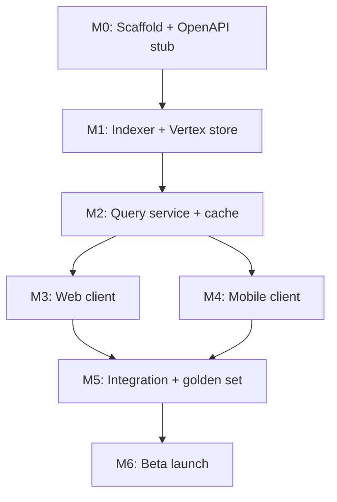

# QuickPickr — Architecture Implementation Plan

| Field | Value |
|-------|-------|
| **Product** | QuickPickr |
| **Version** | 1.0 |
| **Date** | 2026-05-19 |
| **Author** | @system.arch |
| **Status** | Active — Phase 2 build planning |
| **SAD** | [sad.md](./sad.md) |
| **PRD** | [../1.define/prd.md](../1.define/prd.md) |

---

## 1. Purpose

This document translates the [Solution Architecture Document](./sad.md) into an **implementation plan** with milestones, ownership, SLO gates, and current status. It is the execution companion for `@project.mgr`, `@backend.eng`, `@frontend.eng`, `@integration.eng`, and `@qa.eng`.

---

## 2. Non-Negotiable SLOs (from PRD)

These targets are **release blockers** if not met in staging before public launch.

| SLO ID | Metric | Target | Measurement | Alert threshold |
|--------|--------|--------|-------------|-----------------|
| **SLO-LAT-P50** | End-to-end search latency (submit → first byte of response) | **< 1.5s** | Cloud Monitoring histogram `search_latency_ms` | P50 > 1.5s for 10m |
| **SLO-LAT-P95** | End-to-end search latency | **< 3.0s** | Same histogram | **P95 > 3s for 5m** (PRD §11.5) |
| **SLO-FRESH** | Price age at query time (hot-tier SKUs, launch cities) | **≤ 5 min for 95%** of rows | `freshness_age_minutes` P95 | P95 age > 10m |
| **SLO-PARSE** | Parse failure rate per retailer | **< 5%** | `parse_failure_rate{retailer}` | **> 5% for 15m** (PRD §11.5) |
| **SLO-ACC** | Golden-set price accuracy | **≥ 98%** within ±2% of live PDP | QA golden-set job | < 98% on release candidate |
| **SLO-LINK** | Deep link lands on correct PDP | **100%** golden set | Automated link tests | Any failure blocks release |
| **SLO-AVAIL** | Query API monthly uptime | **99.5%** | Cloud Run uptime checks | — |

### 2.1 Latency budget allocation

Aligned with SAD §11.1:

```
Total P95 budget:     3000 ms
├─ Client/network:     350 ms
├─ API (non-Vertex):   450 ms  (auth, cache, parse, rank)
└─ Vertex fan-out:    800 ms  (parallel max per retailer)
   Remaining margin:  1400 ms  (cold start absorption, jitter)
```

**Engineering tactics:**

- `min_instances=1` on Cloud Run prod
- 60s Redis cache on `hash(query|pincode)`
- Per-retailer 800ms `asyncio.wait_for` timeout
- Return partial results; never block on slowest retailer

### 2.2 Freshness implementation checklist

| # | Task | Owner | Status |
|---|------|-------|--------|
| F1 | Define hot/warm/longtail SKU lists | @backend.eng | Not started |
| F2 | Cloud Scheduler → indexer jobs per tier | @backend.eng | Not started |
| F3 | Store `crawledAt` on every indexed document | @backend.eng | Not started |
| F4 | Query API computes `ageMinutes` + stale flag | @backend.eng | Not started |
| F5 | Client renders “Updated N min ago” / stale warning | @frontend.eng | Not started |
| F6 | Dashboard: `freshness_age_minutes` P95 by tier | @backend.eng | Not started |

### 2.3 Parse-failure observability checklist

| # | Task | Owner | Status |
|---|------|-------|--------|
| P1 | Emit `parse_failure_total{retailer, reason}` on parse miss | @backend.eng | Not started |
| P2 | Grafana/Cloud Monitoring dashboard per retailer | @backend.eng | Not started |
| P3 | Alert policy: >5% over 15m → PagerDuty/Slack | @project.mgr | Not started |
| P4 | Runbook: “Retailer X parse failure spike” | @backend.eng | Not started |
| P5 | Golden-set CI fails if parse_failure > threshold | @qa.eng | Not started |
| P6 | Log sample: snippet hash + retailer (no full HTML) | @backend.eng | Not started |

**Parse failure definition:** Vertex returned a document/snippet but `price-parser` could not extract a valid INR price, or `match-engine` rejected match below suppress threshold after parse.

---

## 3. Implementation Approach

### 3.1 Repository layout (target monorepo)

```
quick-pickr-project/
├── apps/
│   ├── web/                 # Next.js
│   ├── mobile/              # React Native
│   └── query-service/       # FastAPI
├── packages/
│   ├── api-contract/        # openapi.yaml
│   └── api-client/          # generated TS SDK
├── jobs/
│   └── indexer/             # Cloud Run Job entrypoint
├── config/
│   ├── retailers.yaml       # deep links, crawl seeds
│   ├── affiliates.json
│   └── zones/               # pincode → zoneId tables
├── infra/                   # Terraform (optional Phase 2b)
└── project-context/
```

### 3.2 Build order (dependency-aware)



**Rationale:** Index must exist before meaningful query integration; API before clients; golden-set gates before beta.

### 3.3 Technology versions (pin at setup)

| Component | Version |
|-----------|---------|
| Python | 3.11+ |
| FastAPI | 0.110+ |
| Next.js | 14+ |
| React Native | 0.74+ |
| Node.js | 20 LTS |
| Vertex SDK | `google-cloud-discoveryengine` latest stable |

---

## 4. Milestones

### M0 — Foundation (Week 1)

| Deliverable | Owner | Exit criteria | Status |
|-------------|-------|---------------|--------|
| Monorepo scaffold | @project.mgr | `apps/`, `packages/`, CI lint | **Not started** |
| `.env.example` complete | @project.mgr | Vertex, Redis, GCP vars documented | **Partial** (root file exists) |
| OpenAPI stub `POST /v1/search` | @backend.eng | Validates request; mock response | **Not started** |
| `setup.md` artifact | @project.mgr | Local dev documented | **Not started** |

### M1 — Indexing layer (Weeks 2–3)

| Deliverable | Owner | Exit criteria | Status |
|-------------|-------|---------------|--------|
| GCP Vertex data store provisioned | @backend.eng | Dev store accepting documents | **Not started** |
| Retailer adapter: Blinkit (pilot) | @backend.eng | 100 SKUs indexed with schema | **Not started** |
| Retailers: Zepto, BigBasket, Instamart | @backend.eng | Same schema, 100 SKUs each | **Not started** |
| Scheduler: hot/warm/longtail jobs | @backend.eng | Jobs run in dev; metrics emitted | **Not started** |
| Pincode → zoneId table (5 cities) | @backend.eng | Bengaluru, Mumbai, Delhi, Hyderabad, Pune | **Not started** |

**M1 gate:** Sample search in Vertex console returns filtered results per retailer + zone.

### M2 — Query service (Weeks 3–4)

| Deliverable | Owner | Exit criteria | Status |
|-------------|-------|---------------|--------|
| FastAPI `POST /v1/search` | @backend.eng | Matches PRD §12 schema | **Not started** |
| Parallel fan-out + 800ms timeout | @backend.eng | Partial results on slow retailer | **Not started** |
| Redis 60s cache | @backend.eng | `cacheHit` in response meta | **Not started** |
| price-parser + match-engine | @backend.eng | Unit tests ≥90% parser paths | **Not started** |
| Deploy to Cloud Run (staging) | @backend.eng | Health check passes | **Not started** |
| Observability: latency + parse_failure metrics | @backend.eng | Dashboard + alert policies live | **Not started** |

**M2 gate:** Staging meets **SLO-LAT-P95** on cache-warmed golden queries; **SLO-PARSE** <5% per retailer in 1hr soak.

### M3 — Web client (Weeks 4–5)

| Deliverable | Owner | Exit criteria | Status |
|-------------|-------|---------------|--------|
| Search + results UI | @frontend.eng | FR-1–3 P0 complete | **Not started** |
| Pincode localStorage | @frontend.eng | US-009 acceptance | **Not started** |
| Trust footer + stale labels | @frontend.eng | AC-T1, AC-T2, AC-T3 | **Not started** |
| Affiliate + deep link handler | @frontend.eng | Config-driven URLs | **Not started** |
| Deploy preview (Vercel/staging) | @frontend.eng | HTTPS to staging API | **Not started** |

### M4 — Mobile client (Weeks 5–6)

| Deliverable | Owner | Exit criteria | Status |
|-------------|-------|---------------|--------|
| RN search + results parity | @frontend.eng | Same rank order as web | **Not started** |
| Deep links iOS/Android | @frontend.eng | AC-4 golden set on 2 devices | **Not started** |
| Analytics events | @frontend.eng | PRD §14 events firing | **Not started** |

**M4 may slip to v1.1 if web-only beta is approved.**

### M5 — Integration and QA (Week 6)

| Deliverable | Owner | Exit criteria | Status |
|-------------|-------|---------------|--------|
| E2E: search → click-out | @integration.eng | Documented in `integration.md` | **Not started** |
| Golden-set automation (50×5) | @qa.eng | AC-1–AC-8, AC-T1–T5 | **Not started** |
| Load test k6 100 RPS | @qa.eng | SLO-LAT-P95 pass | **Not started** |
| `qa.md` with known gaps | @qa.eng | Published | **Not started** |

**M5 gate (release):** All §2 non-negotiable SLOs pass in **staging** for 48h.

### M6 — Closed beta (Week 7+)

| Deliverable | Owner | Exit criteria | Status |
|-------------|-------|---------------|--------|
| 5-city index coverage | @backend.eng | ≥3/4 retailers on top-500 SKUs | **Not started** |
| App Store / Play submission | @frontend.eng | If mobile in scope | **Not started** |
| Beta cohort 500 users | @product-mgr | Trust survey ≥4/5 | **Not started** |

---

## 5. Workstream Status Summary

| Workstream | Phase | Status | Blocker |
|------------|-------|--------|---------|
| Requirements (MRD/PRD) | Define | **Complete** | — |
| Solution architecture (SAD) | Define/Build | **Complete** | — |
| Repo scaffold | Build M0 | **Not started** | Awaiting `*setup-project` |
| Indexing / Vertex | Build M1 | **Not started** | GCP project + credentials |
| Query service | Build M2 | **Not started** | M1 sample index |
| Web client | Build M3 | **Not started** | M2 staging API |
| Mobile client | Build M4 | **Not started** | M2 staging API |
| Integration / QA | Build M5 | **Not started** | M3/M4 |
| Beta launch | Build M6 | **Not started** | M5 gates |

**Overall project status:** `DEFINE_COMPLETE` → `BUILD_READY`

---

## 6. Environment and Configuration

### 6.1 Required secrets (expand `.env.example`)

```bash
# Google Cloud
GOOGLE_CLOUD_PROJECT=
GOOGLE_APPLICATION_CREDENTIALS=
VERTEX_DATA_STORE_ID=
VERTEX_SEARCH_SERVING_CONFIG=

# Cache
REDIS_URL=redis://localhost:6379/0

# API
API_KEY=                          # optional MVP client auth
CORS_ORIGINS=http://localhost:3000

# Observability
OTEL_EXPORTER_OTLP_ENDPOINT=
ENVIRONMENT=dev
```

### 6.2 Per-environment Vertex stores

| Env | Data store | Index refresh |
|-----|------------|---------------|
| dev | `quickpickr-dev` | Manual / hourly |
| staging | `quickpickr-staging` | Hot tier every 15m |
| prod | `quickpickr-prod` | Hot tier every 5m |

---

## 7. Risk Register (implementation)

| Risk | Probability | Impact | Mitigation | Owner |
|------|-------------|--------|------------|-------|
| Vertex indexing delays | Medium | Freshness SLO miss | Hot tier job monitoring; backfill playbook | @backend.eng |
| Parser break on site redesign | High | SLO-PARSE alert | Per-retailer adapter version pins; CI golden set | @backend.eng |
| Cloud Run cold start | Medium | SLO-LAT-P50 miss | min_instances=1; keep-alive probe | @project.mgr |
| Deep link drift | Medium | UTR-04 | Weekly link crawler; config YAML | @frontend.eng |
| GCP cost overrun | Medium | Budget | Cache, query rate limits, budget alert 80% | @project.mgr |

---

## 8. Definition of Done (MVP release)

- [ ] All P0 user stories (US-001–009, US-013) pass acceptance tests
- [ ] SLO-LAT-P50, SLO-LAT-P95, SLO-FRESH, SLO-PARSE met in staging 48h
- [ ] Golden-set: AC-1–AC-8 and AC-T1–AC-T5 green
- [ ] `setup.md`, `backend.md`, `frontend.md`, `integration.md`, `qa.md` published
- [ ] Privacy policy linked; DPDP notice live
- [ ] Runbooks: parse failure spike, Vertex outage, indexer failure
- [ ] No sponsored rows in production (UTR-06)

---

## 9. Immediate Next Actions

| Priority | Action | Persona | ETA |
|----------|--------|---------|-----|
| 1 | Run `*setup-project` — scaffold monorepo per §3.1 | @project.mgr | Week 1 |
| 2 | Provision GCP Vertex data store (dev) | @backend.eng | Week 1 |
| 3 | Implement Blinkit indexer adapter (pilot) | @backend.eng | Week 2 |
| 4 | Implement query-service skeleton + mock | @backend.eng | Week 2 |
| 5 | Expand `.env.example` per §6.1 | @project.mgr | Week 1 |

---

## Sources

| # | Artifact |
|---|----------|
| 1 | [sad.md](./sad.md) |
| 2 | [prd.md](../1.define/prd.md) §9, §11, §13, §15 |
| 3 | [mrd.md](../1.define/mrd.md) §5 User Trust Risk |

---

## Assumptions

1. Team capacity: 1 backend, 1 frontend (web+mobile), 1 part-time QA for MVP timeline (~7 weeks).
2. GCP billing and Vertex quotas approved before M1.
3. Web-only beta acceptable if mobile slips one milestone.
4. Golden-set queries maintained by @qa.eng in `tests/golden/`.

---

## Open Questions

| # | Question | Owner | Default |
|---|----------|-------|---------|
| 1 | Web-only beta vs web+mobile simultaneous? | @product-mgr | Web first |
| 2 | Terraform now or manual GCP console for MVP? | @project.mgr | Manual dev; Terraform staging+ |
| 3 | Who owns on-call for parse-failure alerts? | @project.mgr | Backend rotation |

---

## Audit

| Timestamp (UTC) | Persona | Action |
|-----------------|---------|--------|
| 2026-05-19T18:00:00Z | @system.arch | Architecture implementation plan created with SLOs, milestones, and status |
