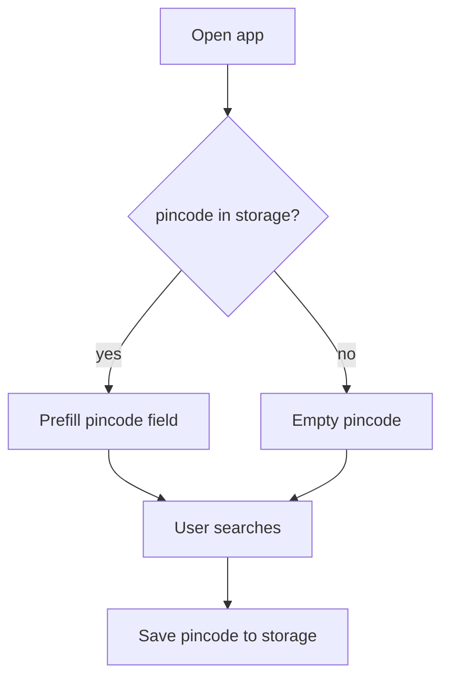

# QuickPickr — Frontend Implementation Plan

| Field | Value |
|-------|-------|
| **Version** | 1.0 |
| **Date** | 2026-05-19 |
| **Author** | @frontend.eng |
| **Status** | MVP implemented — QA pending |
| **Inputs** | [prd.md](../1.define/prd.md), [mrd.md](../1.define/mrd.md), [sad.md](./sad.md) |
| **Artifact log** | [frontend.md](./frontend.md) |

---

## 1. Objectives

Deliver **web** (Next.js 14+ App Router) and **mobile** (React Native + Expo) clients that:

- Share `packages/api-contract`, `packages/api-client`, `packages/design-tokens`, `packages/shared`
- Call `POST /v1/search` on the FastAPI query service
- Meet PRD P0 UX, trust copy, accessibility, and acceptance bar for golden query

---

## 2. UI components

| ID | Component | Platform | Priority | Status | Notes |
|----|-----------|----------|----------|--------|-------|
| FC-01 | `SearchForm` — product + pincode, submit, Enter key | Web, Mobile | P0 | Done | Validates pincode `^[1-9][0-9]{5}$` |
| FC-02 | `UseLocationButton` — geocode → pincode (P1 stub) | Web, Mobile | P1 | Done (web geolocation); mobile permission flow |
| FC-03 | `SearchSkeleton` — table placeholders <200ms | Web, Mobile | P0 | Done | Shown immediately on submit |
| FC-04 | `ResultsTable` — 4 retailer rows | Web, Mobile | P0 | Done | Sort client-side mirrors API |
| FC-05 | `ResultRow` — logo, image, title, pack, unit, price, freshness | Web, Mobile | P0 | Done | |
| FC-06 | `LowestPriceBadge` — text label, not color-only | Web, Mobile | P0 | Done | WCAG |
| FC-07 | `ClosestMatchBadge` | Web, Mobile | P0 | Done | `matchConfidence: low` |
| FC-08 | `StalePriceWarning` — age >5 min | Web, Mobile | P0 | Done | PRD OQ-3 default: show warning |
| FC-09 | `BuyCta` — deep link + affiliate inject | Web, Mobile | P0 | Done | `config/retailers.yaml` + `affiliates.json` |
| FC-10 | `UnavailableRow` / `ErrorRow` copy | Web, Mobile | P0 | Done | FR-3.3, FR-3.4 |
| FC-11 | `TrustFooter` | Web, Mobile | P0 | Done | US-013, AC-T1 |
| FC-12 | `SearchHistoryList` — last 20 | Web, Mobile | P1 | Done | localStorage / AsyncStorage |
| FC-13 | `SettingsScreen` — clear pincode + history | Web, Mobile | P1 | Done | |
| FC-14 | `PrivacyPage` — DPDP notice | Web, Mobile | P0 | Done | Web `/privacy`; mobile stack screen |
| FC-15 | `ApiErrorBanner` — 400/429/503 | Web, Mobile | P0 | Done | |
| FC-16 | `LanguageToggle` — EN / HI | Web, Mobile | P1 | Done | UI strings; query accepts mixed script |

---

## 3. User interaction flows

### 3.1 First launch → pincode cached



### 3.2 Search submit

| Step | Behavior |
|------|----------|
| 1 | Disable form; show skeleton within 200ms |
| 2 | `POST /v1/search` + `X-Session-Id` |
| 3 | On success: render rows sorted by `finalPriceInr` asc |
| 4 | Mark cheapest available row “Lowest price” |
| 5 | Emit `search_completed` |
| 6 | Push query to history (max 20) |

### 3.3 Buy CTA

| Step | Behavior |
|------|----------|
| 1 | Read `buyUrl` from row |
| 2 | Apply affiliate query params from `config/affiliates.json` if enabled |
| 3 | Web: `window.open`; Mobile: `Linking.openURL` (custom scheme if mapped) |
| 4 | Emit `retailer_clickout` |

### 3.4 Stale row (product decision logged)

**Decision:** Show row with **“Price may be outdated”** when `crawledAt` age > 5 minutes (PRD OQ-3 default). Emit `stale_row_shown`.

**Open for @product-mgr:** Include delivery time in rank? → **Deferred v1** (price only).

---

## 4. API integration

| Concern | Implementation |
|---------|----------------|
| Contract | `packages/api-contract/openapi.yaml` |
| Client | `packages/api-client` — `QuickPickrClient.search()` |
| Base URL | Web: `NEXT_PUBLIC_API_URL`; Mobile: `EXPO_PUBLIC_API_URL` |
| Headers | `Content-Type: application/json`, `X-Session-Id: <uuid>` |
| Errors | 400 → validation message; 429 → rate limit copy; 503 → retry message |

### Client events

| Event | When |
|-------|------|
| `search_completed` | After successful search |
| `retailer_clickout` | Buy CTA tap |
| `stale_row_shown` | Row rendered with stale warning |
| `trust_feedback` | Settings → optional 1–5 rating (beta) |

---

## 5. Implementation approach

### 5.1 Monorepo layout

```
packages/
  api-contract/openapi.yaml
  api-client/
  design-tokens/
  shared/
apps/
  web/          # Next.js 14
  mobile/       # Expo + React Native
config/
  affiliates.json
  retailers.json
```

### 5.2 Web — Next.js

- App Router, TypeScript, Tailwind
- Deploy: Vercel or `output: standalone` for Cloud Run
- Env: `NEXT_PUBLIC_API_URL=http://127.0.0.1:8080`

### 5.3 Mobile — React Native (Expo)

- Expo SDK 51+, React Navigation native stack
- AsyncStorage via `packages/shared` storage adapter
- Deep links: `Linking` + retailer URL templates

### 5.4 Accessibility (WCAG 2.1 AA)

- Semantic `<table>` on web with `<th scope="row">`
- `aria-live="polite"` on results region
- Focus management after search
- “Lowest price” as visible text
- 44px min touch targets on mobile

### 5.5 i18n

- `packages/shared/i18n` — `en`, `hi` string tables
- Product input: no script forcing (FR-1.2)

---

## 6. Acceptance bar (v1 frontend)

| ID | Criterion | Status | Blocker |
|----|-----------|--------|---------|
| AC-FE-1 | `Amul Gold 500 ml` + `560034` E2E on web | Pending QA | API must return ≥1 priced row |
| AC-FE-2 | P95 <3s perceived (skeleton @200ms) | Pending load test | Network + Vertex latency |
| AC-FE-3 | Cheapest CTA opens correct PDP (mobile) | Pending device test | Requires real `buyUrl` in index |
| AC-FE-4 | Pincode persists across sessions | **Done** | localStorage / AsyncStorage |
| AC-FE-5 | Same rank order web vs mobile same query | **Done** | Shared `sortResults()` |

---

## 7. Component checklist (live)

| Component | Web | Mobile | PR | Blocker |
|-----------|-----|--------|-----|---------|
| SearchForm | ✅ | ✅ | — | — |
| ResultsTable | ✅ | ✅ | — | — |
| History | ✅ | ✅ | — | — |
| Settings | ✅ | ✅ | — | — |
| Privacy | ✅ | ✅ | — | — |
| Hindi UI | ✅ | ✅ | — | — |
| Geolocation pincode | ✅ | ✅ | — | Nominatim reverse geocode (dev) |

---

## 8. UX questions for @product-mgr

| # | Question | FE default |
|---|----------|------------|
| Q1 | Delivery time in results? | Hidden v1 |
| Q2 | Stale row >5 min | Show with warning |
| Q3 | Progressive SSE per retailer? | Single response v1; skeleton only |

---

## 9. Decisions log

| Date | Decision | Rationale |
|------|----------|-----------|
| 2026-05-19 | Expo for mobile MVP | Faster AsyncStorage + Linking vs bare RN |
| 2026-05-19 | Hand-written api-client | Avoid openapi-generator CI dependency for MVP |
| 2026-05-19 | Shared sort in `shared/results.ts` | Identical web/mobile ordering |
| 2026-05-19 | Open-Meteo/Nominatim for geocode (web) | P1 affordance without Google Maps key |

---

## Audit

| Timestamp (UTC) | Persona | Action |
|-----------------|---------|--------|
| 2026-05-19T22:00:00Z | @frontend.eng | Initial frontend plan |
| 2026-05-19T22:30:00Z | @frontend.eng | Implementation started; checklist updated |
| 2026-05-19T23:00:00Z | @frontend.eng | Web + mobile MVP complete; see frontend.md |
