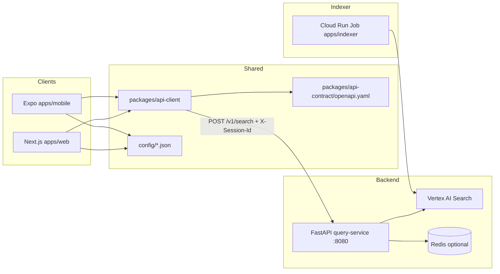

# QuickPickr — Integration Plan

| Field | Value |
|-------|-------|
| **Version** | 1.1 |
| **Updated** | 2026-05-21 |
| **Author** | @integration.eng |
| **Inputs** | [prd.md](../1.define/prd.md), [mrd.md](../1.define/mrd.md), [sad.md](./sad.md), [frontend-plan.md](./frontend-plan.md), [backend-plan.md](./backend-plan.md) |

---

## 1. End-to-end architecture

---

## 2. Frontend ↔ backend

| Item | Status | Notes |
|------|--------|-------|
| OpenAPI snapshot | Done | `packages/api-contract/openapi.yaml` — regenerate via `python scripts/export_openapi.py` |
| TypeScript SDK | Done | `packages/api-client` — manual types aligned with OpenAPI (`types.ts` comment) |
| `POST /v1/search` wiring | Done | `QuickPickrClient.search()` |
| `X-Session-Id` header | Done | Session from `@quickpickr/shared` storage; header set in client |
| **fetch binding** | Done | `fetch.bind(globalThis)` in `QuickPickrClient` constructor |
| Error UX | Done | **400** validation, **429** rate limit, **503** copy in `parseError` (extend for **502**/upstream as needed) |
| Skeleton ≥200ms | Done | `HomeSearch` / mobile `setTimeout` 200ms before skeleton |
| E2E latency budget | Partial | **P50 &lt; 1.5s / P95 &lt; 3s** requires production measurement (k6 / Cloud Monitoring); clients show `meta.latencyMs` |

**Decisions**

- Single root command **`npm run dev`** runs **Next.js :3000** and **uvicorn :8080** via `concurrently` + `scripts/run-query-service-dev.cjs` (sets `PYTHONPATH` for `apps/query-service`).
- CORS allowlist matches `.env` `CORS_ORIGINS` (`localhost` / `127.0.0.1` :3000 defaults in backend).

---

## 3. Indexer ↔ Vertex AI Search

| Item | Status | Notes |
|------|--------|-------|
| Single data store | Planned | Same engine QuickPickr searches |
| Filterable `retailer`, `zoneId` | Planned | Schema + Console facet config |
| Scheduler tiers (hot / warm / long-tail) | Doc | [apps/indexer/README.md](../../apps/indexer/README.md), [sad.md](./sad.md) §5.3 |
| Field alignment query ↔ indexer | Doc | Indexer writes struct fields (`priceInr`, `productUrl`, …); website crawl supplies `title`, `link`, `snippets` — backend merges **struct_data + derived_struct_data** |

**Open question:** Exact Console attribute names for filters (`retailer` / `zoneId`) vs engine defaults — tune per environment ([backend-plan](./backend-plan.md) B-1).

---

## 4. External services

| Service | Role | Integration state |
|---------|------|-------------------|
| **Vertex AI Search** | Retrieval | SA JSON + `load_dotenv` → `os.environ` locally; Workload Identity on Cloud Run ([backend-plan §1](./backend-plan.md)) |
| **Redis Memorystore** | 60s cache + single-flight | `REDIS_URL` optional; in-memory fallback ([backend-plan](./backend-plan.md)) |
| **Nominatim** | Reverse geocode → pincode (web) | [apps/web/src/lib/geocode.ts](../../apps/web/src/lib/geocode.ts) — polite **User-Agent**, `fetch.bind(globalThis)` |
| **Deep links + affiliates** | CTA | [config/retailers.json](../../config/retailers.json), [config/affiliates.json](../../config/affiliates.json); `applyAffiliateParams` — **does not affect sort** (`sortResults` on prices only) |
| **OpenTelemetry** | Trace / metrics / logs | Counter hooks in query-service; **full OTLP → Cloud Trace/Monitoring** deferred ([backend-plan](./backend-plan.md)) |
| **Analytics sink** | Client events | **Decision:** MVP uses `track()` → pluggable `setAnalyticsSink` (default `console.debug`). **Target:** GA4 Measurement Protocol or **BigQuery** batch from Cloud Run / Pub/Sub — not wired in-repo yet |

---

## 5. Pincode → zoneId

| Approach | Detail |
|----------|--------|
| Resolver | Static JSON `apps/query-service/data/pincode_zones.json` + fallback `IND-{pincode}-{retailer}` ([backend-plan](./backend-plan.md)) |
| Retailer APIs | Not integrated — future when retailers expose stable zone/serviceability APIs |

---

## 6. Configuration matrix

| Location | Variables |
|----------|-----------|
| Repo `.env` | `VERTEX_SEARCH_SERVING_CONFIG`, `GOOGLE_APPLICATION_CREDENTIALS`, `GOOGLE_CLOUD_PROJECT` (scripts/terraform), `VERTEX_DATA_STORE_ID` / branch naming for indexer ops, optional `REDIS_URL`, `CORS_ORIGINS` |
| `apps/web/.env.local` | `NEXT_PUBLIC_API_URL` → Cloud Run URL or `http://127.0.0.1:8080` |
| Mobile | `EXPO_PUBLIC_API_URL` — mirror API URL |

---

## 7. QA / testing strategy

Traceability: [prd.md §13 Acceptance Criteria](../1.define/prd.md#131-golden-path-tests), [§7.2 Edge paths](../1.define/prd.md#72-edge-paths), [sad.md](./sad.md) (NFRs, security, a11y). **Owner:** `@qa.eng` for formal sign-off; integration documents the matrix for handoff.

### 7.1 What runs in-repo today

| Command | Purpose |
|---------|---------|
| `npm run verify:contract` | Fails CI if `packages/api-contract/openapi.yaml` is missing or empty |
| `npm run typecheck` | TS packages + web compile check |
| `python scripts/verify_vertex.py "<query>"` | ADC + serving config smoke; blended search hits (requires `.env`) |
| `Invoke-RestMethod` / curl `POST /v1/search` | API shape + four-row contract with running `uvicorn` |
| Manual `npm run dev` | Web + API; UI skeleton (200ms), errors 400/429, session header |

### 7.2 Release-blocker matrix (PRD §13.1)

| ID | Intent | How to verify | Notes |
|----|--------|---------------|-------|
| **AC-1** | ≥3 `available` for Amul Gold @ 560034 | Record demo video + JSON export from staging index | Depends on Vertex index coverage |
| **AC-2** | ±2% vs live PDP | Manual spot-check same SKU/time window; spreadsheet log | Not automated in-repo |
| **AC-3** | P95 &lt; 3s over 1000 queries | k6 or Cloud Monitoring on staging with warmed cache | Target **P50 &lt; 1.5s** aligns with integration SLO narrative |
| **AC-4** | Deep-link correctness iOS/Android | Golden PDP URLs per retailer; tap-test on devices | Weekly job (planned) validates URL pattern health |
| **AC-5** | `milk` → `matchConfidence: low` + label | Assert in API JSON + web/mobile UI | |
| **AC-6** | Nonsense SKU → graceful empty / 200 | e.g. `Macallan 18` | No 5xx from client perspective |
| **AC-7** | Pincode persistence | Clear data, set 110001, kill app, reopen | localStorage / AsyncStorage |
| **AC-8** | Web vs mobile rank parity | Same `query+pincode` within freshness TTL | Compare `results[].retailer` order |

**Trust (PRD §13.2):** AC-T1, AC-T3, AC-T5 are **hard stops** — see PRD §6.3; do not ship if they fail.

**Regression (PRD §13.3):** Maintain **golden set** (50 queries × 5 pincodes) in **staging CI**; block if AC-1–AC-4 fail on that set.

### 7.3 Manual smoke checklist (every release candidate)

Use after `npm run dev` + configured `.env`:

- [ ] **Health:** `GET /health` → `ok` or expected `degraded` with message (Vertex reachable).
- [ ] **Search:** Four rows present; prices sorted ascending for `available` rows; `Lowest price` on cheapest.
- [ ] **Errors:** One retailer forced timeout (optional env tuning) → row `error` + others still populate.
- [ ] **Rate limit:** Send 31 rapid requests with same `X-Session-Id` → **429** and user-friendly message.
- [ ] **CORS:** Web origin allowed; preflight from `http://localhost:3000` succeeds.
- [ ] **Affiliates:** With `config/affiliates.json` enabled for a retailer, CTA URL includes params; **sort order unchanged**.
- [ ] **Telemetry:** `search_completed`, `retailer_clickout`, `stale_row_shown` (when stale), `trust_feedback` visible in sink (default: console) or wired sink.
- [ ] **Pincode prefix logging:** Backend logs must **not** contain full 6-digit pincode in plaintext (see SAD §8.3).

### 7.4 Contract & API tests (planned automation)

| Layer | Proposal | Artifact |
|-------|----------|----------|
| OpenAPI drift | Diff or validate `openapi.yaml` against FastAPI `app.openapi()` in CI (`python scripts/export_openapi.py` + `git diff --exit-code`) | Extend `scripts/` |
| Response schema | `schemathesis` or pytest + `jsonschema` against `/v1/search` and `/health` fixtures | `apps/query-service/tests/` |
| Error codes | Assert **400** (invalid body), **429** (rate limit), consistent error body shape | pytest + `httpx` / `TestClient` |

### 7.5 Parser & Vertex golden-set (backend)

| Goal | Approach |
|------|-----------|
| INR + struct merge | Save ~50 **redacted** `SearchResponse` payloads (or Discovery Engine document JSON) under `apps/query-service/tests/fixtures/vertex/` |
| Assertions | pytest parametrized: expected `finalPriceInr`, `retailer`, snippet fallback behavior |
| Regression | Run on every PR touching `price_parser/` or `search_adapter/` |

Mirror PRD §13.3 scale over time (50×5 pincode matrix in staging).

### 7.6 E2E UI & mobile

| Scope | Tooling | Priority |
|-------|---------|----------|
| Web critical path | Playwright — fill query/pincode, submit, wait for table, click Buy | Post-M1 |
| Mobile deep links | Expo dev client / Maestro — AC-4 device matrix | Post-M1 |
| Offline / edge | Mock API offline → FR edge expectations (PRD §7.2) | P1 |

### 7.7 Load, performance, observability

| Test | Target | Tool |
|------|--------|------|
| Steady load | ~100 RPS with **warm cache**; watch error rate & latency | k6 script hitting `/v1/search` + Redis optional |
| Cold vs warm | Compare `meta.cacheHit` and `latencyMs` distributions | Cloud Monitoring dashboards (prod) |
| OTEL | Once exporters wired: trace fan-out spans per retailer; metrics `search_latency_ms`, `cache_hit_rate`, etc. | Align with [backend-plan](./backend-plan.md) |

### 7.8 Accessibility & UX quality

| Check | Reference |
|-------|-----------|
| Keyboard / focus order | Search form → results → CTA |
| Color contrast | Not relying on color alone for “lowest price” (PRD FR-3.5 text label) |
| Automated axe | Run `@axe-core/playwright` or CI axe against `/` after Playwright lands |
| Skeleton vs spinner | FR-2.1–2.3 within **200ms** skeleton |

---

## 8. Known issues already fixed (do not regress)

| Issue | Mitigation |
|-------|------------|
| `pydantic-settings` ≠ `os.environ` | `load_dotenv()` in `apps/query-service/app/config.py` |
| Native **Illegal invocation** on fetch | `fetch.bind(globalThis)` in **api-client**; **geocode** uses bound fetch |
| Vertex **MapComposite** snippets | `hasattr(first, "get")`; merge derived + struct ([search_adapter/common.py](../../apps/query-service/app/search_adapter/common.py)) |
| Non-target retailers in index (e.g. Flipkart) | **Strict filter:** `search_filtered` + `pick_best_for_retailer` only keep `blinkit` / `zepto` / `bigbasket` / `instamart` |
| Next lockfile patcher / workspaces | Root **`.npmrc` `optional=true`**; **no** `apps/web/package-lock.json`; single root lockfile |
| Two processes for E2E | **`npm run dev`** starts **web + api** together |

---

## 9. Open questions (product / v1.1)

- Show **delivery time** alongside price in v1?
- **Multi-item compare-basket** timing and API shape?
- Default UX when **`crawledAt` exceeds freshness window** — block CTA vs warn-only (currently warn + `stale_row_shown` telemetry)?

---

## 10. Progress log

| When | What |
|------|------|
| 2026-05-20 | `npm run dev` (concurrently), contract check script, retailer strict filter, stale analytics web+mobile, Nominatim fetch bind, README happy path |
| 2026-05-21 | Expanded §7 QA/testing (PRD AC matrix, smoke checklist, automation roadmap, load/a11y) |

---

## Sources

- [prd.md](../1.define/prd.md) §13 acceptance, §7.2 edge journeys
- [sad.md](./sad.md) §13 testing architecture; NFR / operational expectations elsewhere in SAD
- [frontend-plan.md](./frontend-plan.md), [backend-plan.md](./backend-plan.md)

---

## Assumptions

- Contributors have **Python** and **Node** on PATH; `python` launches the same environment where `pip install -r apps/query-service/requirements.txt` was run.

---

## Audit

| UTC | Persona | Action |
|-----|---------|--------|
| 2026-05-20 | @integration.eng | integration-plan.md v1 + wiring |
| 2026-05-21 | @integration.eng | QA/testing section expansion |
