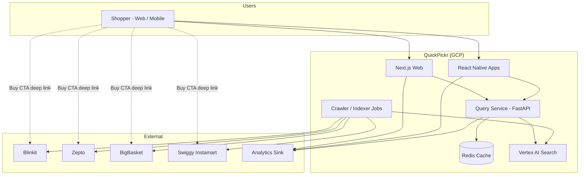
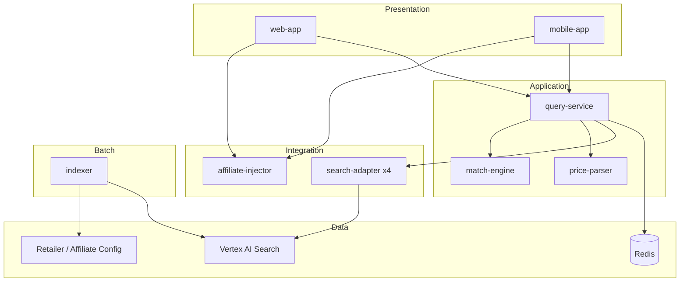
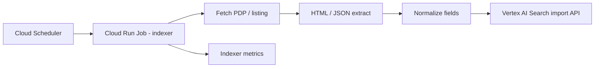
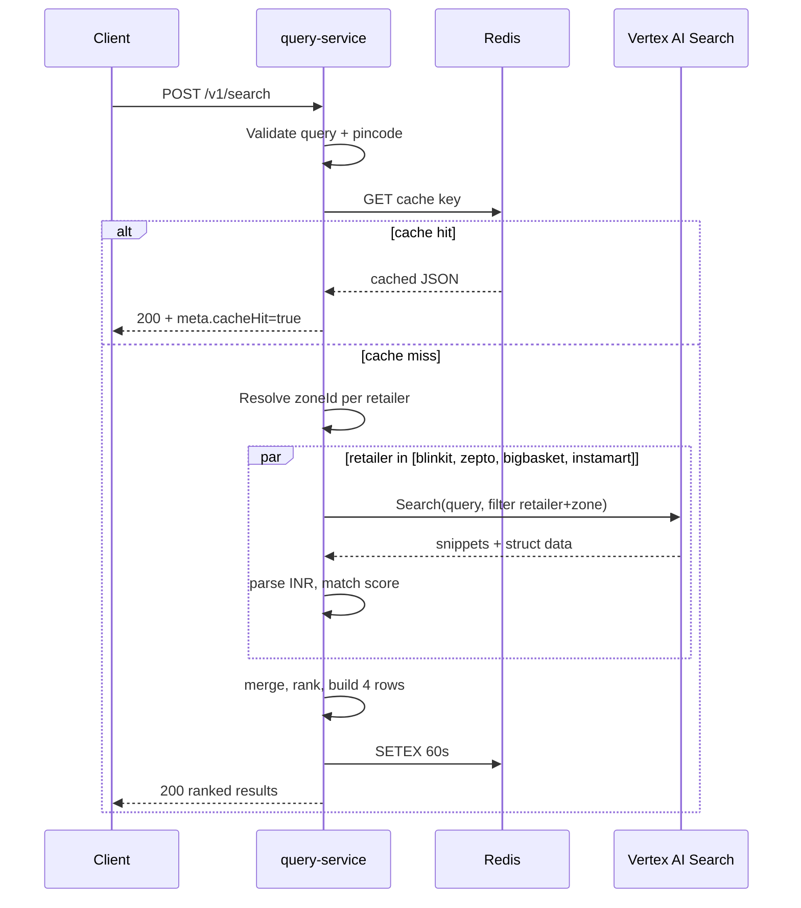
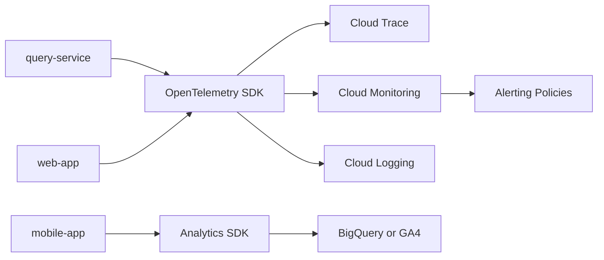
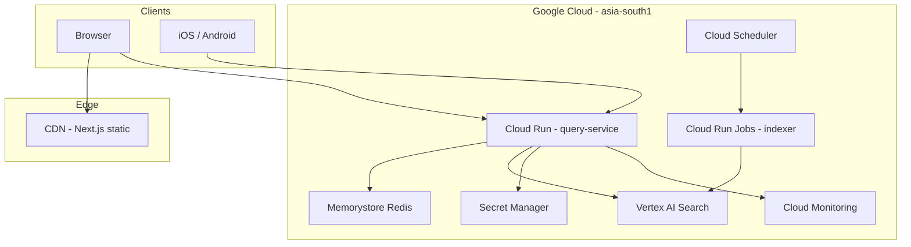

# QuickPickr — Solution Architecture Document (SAD)

| Field | Value |
|-------|-------|
| **Product** | QuickPickr — Quick-Commerce Price Comparison (India) |
| **Version** | 1.0 (MVP) |
| **Date** | 2026-05-19 |
| **Author** | @system.arch |
| **Status** | Approved for Phase 2 build |
| **Inputs** | [prd.md](../1.define/prd.md) v1.1, [mrd.md](../1.define/mrd.md) v1.1 |
| **Companion** | [architecture-plan.md](./architecture-plan.md) |
| **AAMAD_TARGET_RUNTIME** | `cursor-sdk` (IDE/build agents); application runtime is **Python FastAPI + GCP Vertex AI Search** |

---

## 1. Architecture Philosophy and MVP Scope

### 1.1 Design principles

| Principle | Architectural implication |
|-----------|---------------------------|
| **Discovery-only** | No cart, payment, or inventory services; minimize PCI and commerce scope |
| **Trust by transparency** | Freshness, match confidence, and four-row completeness are first-class data fields |
| **Latency-budgeted fan-out** | Parallel per-retailer search with hard timeouts; partial results beat slow completeness |
| **Index-time vs query-time** | Prices parsed at index and query; query path is read-heavy and cacheable |
| **Observable failure** | `parse_failure_rate` per retailer is a primary SLO, not a debug metric |
| **Client simplicity** | Shared OpenAPI contract; clients do not call Vertex AI directly |

### 1.2 MVP boundary (80/20)

**In scope (MVP):**

- Single-SKU search across four retailers with pincode
- Vertex AI Search index + scheduled crawler refresh tiers
- FastAPI query service on Cloud Run with 60s response cache
- Next.js web + React Native mobile sharing `POST /v1/search`
- Deep links (custom scheme + HTTPS fallback) and optional affiliate query params
- Structured telemetry, traces, and SLO-based alerts

**Deferred (post-MVP):**

- Multi-item basket optimization (PRD FR-12)
- User accounts and server-side history (FR-15)
- Sponsored placements (UTR-06) until trust baseline met
- Additional retailers beyond the big four
- LLM-based match confidence in query hot path (rules-only for MVP)

### 1.3 Key architectural decisions

| ID | Decision | Rationale | Alternatives rejected |
|----|----------|-----------|----------------------|
| **AD-01** | **Vertex AI Search** as retrieval layer | Managed semantic search over retailer HTML/catalog; PRD-mandated | Self-hosted Elasticsearch (higher ops); live scrape per request (latency, ToS) |
| **AD-02** | **FastAPI** query service (stateless) | Async fan-out, OpenAPI codegen for TS clients, Cloud Run fit | Next.js API routes only (couples web deploy to API scale) |
| **AD-03** | **Per-retailer parallel queries** with 800ms P95 budget each | Meets P95 <3s E2E with margin; isolates slow retailer | Single blended search (worse relevance filtering) |
| **AD-04** | **60s query cache** keyed `hash(normalize(query)\|pincode)` | Reduces Vertex cost and tail latency on hot queries | No cache (cost); CDN cache (wrong granularity) |
| **AD-05** | **Rules-based SKU match** for MVP | Deterministic, testable; aligns with UTR-02 | LLM grounding on every query (latency + cost) |
| **AD-06** | **Redis (Memorystore)** for shared cache in prod; in-memory for local | Consistent cache across Cloud Run instances | Sticky sessions (fragile on serverless) |
| **AD-07** | **Separate indexer job** (Cloud Run Job + Scheduler) | Decouples crawl cadence from user traffic | Inline crawl on search (violates latency SLO) |

---

## 2. Stakeholders and Concerns

| Stakeholder | Concerns | Architectural response |
|-------------|----------|------------------------|
| **Shopper (Priya)** | Fast, accurate, trustworthy comparison | Latency budget §7; trust fields in API; UTR mitigations |
| **Product / PM** | MVP speed, measurable KPIs | Phased milestones in [architecture-plan.md](./architecture-plan.md) |
| **Engineering** | Maintainable parsers, clear contracts | OpenAPI, golden-set CI, per-retailer adapter modules |
| **Operations** | Cost, alerts, incident response | GCP monitoring, parse-failure alerts, runbooks |
| **Legal / Compliance** | DPDP, scraping, attribution | Public pages only; robots.txt; no PII server storage v1 |
| **Retailers (indirect)** | Deep links, brand use | Logo assets licensed; outbound only; affiliate tags optional |

---

## 3. System Context



---

## 4. Logical View

### 4.1 Component catalog

| Component | Responsibility | Technology |
|-----------|----------------|------------|
| **web-app** | Search UI, results table, pincode localStorage, deep-link CTAs | Next.js 14+ App Router, TypeScript, Tailwind |
| **mobile-app** | Same flows as web; native deep links | React Native, TypeScript, shared API SDK |
| **query-service** | Validate input, cache, fan-out, parse, rank, respond | Python 3.11+, FastAPI, uvicorn |
| **search-adapter** | Per-retailer Vertex AI Search client + filter construction | Python module per retailer |
| **price-parser** | INR extraction, unit price, pack normalization | Python; regex + structured fields |
| **match-engine** | `matchConfidence` scoring; suppress below threshold | Python rules engine |
| **indexer** | Fetch PDP/listing pages, extract fields, upsert to Vertex | Cloud Run Job, Python |
| **pincode-resolver** | Map pincode → `zoneId` / serviceability facet | Static lookup table + optional geocode API (P1) |
| **telemetry** | Traces, metrics, structured logs | OpenTelemetry → Cloud Trace/Monitoring |
| **affiliate-injector** | Append partner query params to `buyUrl` when configured | Config-driven middleware in clients |

### 4.2 Layered architecture



---

## 5. Indexing Layer Architecture

### 5.1 Vertex AI Search topology

**Model:** One **GCP project** with **Discovery Engine / Vertex AI Search** data store(s).

**Recommended MVP layout:**

| Option | Structure | When to use |
|--------|-----------|-------------|
| **A (recommended)** | Single data store; `retailer` + `zoneId` as filterable custom attributes | Simpler ops; filter at query time |
| B | Four data stores (one per retailer) | Strong isolation; more config overhead |

**Document schema (indexed fields):**

| Field | Type | Filterable | Notes |
|-------|------|------------|-------|
| `retailer` | enum string | Yes | `blinkit`, `zepto`, `bigbasket`, `instamart` |
| `zoneId` | string | Yes | Derived from pincode clusters (see §5.3) |
| `pincode` | string | Optional | Store when 1:1 mapping exists |
| `skuId` | string | No | Retailer-native ID |
| `title` | string | No | Full-text searchable |
| `packSize` | string | No | Normalized where possible |
| `priceInr` | number | No | Parsed at index time |
| `imageUrl` | string | No | HTTPS CDN URL |
| `productUrl` | string | No | Canonical PDP for deep link |
| `crawledAt` | datetime | No | ISO8601 UTC |
| `freshnessTier` | enum | Yes | `hot`, `warm`, `longtail` |

### 5.2 Crawler / indexer pipeline



**Retailer adapters:** One Python package per retailer implementing:

- `discover_urls(zoneId) -> Iterable[url]`
- `parse_document(html) -> IndexDocument`
- `rate_limit_policy` per robots.txt

**Compliance:** Respect `robots.txt`, configurable crawl delay, User-Agent identifying QuickPickr bot, cease on C&D legal signal.

### 5.3 Refresh policy (rolling)

| Tier | SKU set | Cadence | Scheduler | PRD ref |
|------|---------|---------|-----------|---------|
| **Hot** | Top 500 national staples | Every **2–5 min** | `*/5 * * * *` (tune per cost) | PRD §11.2 |
| **Warm** | Top 10K | **Hourly** | `0 * * * *` | PRD §11.2 |
| **Long tail** | Remainder | **Daily** | `0 3 * * *` | PRD §11.2 |

Indexer marks `freshnessTier` on each document. Query service computes `ageMinutes = now - crawledAt` for display and stale labeling.

**Freshness SLO (non-negotiable):** ≥**95%** of rows returned in production have `ageMinutes ≤ 5` for hot-tier SKUs in launch cities (PRD §9.3, MRD §11.4).

### 5.4 Pincode and zone resolution

| Approach | MVP | Notes |
|----------|-----|-------|
| Static mapping table | Yes | `pincode_prefix` or full pincode → `zoneId` per retailer |
| Live serviceability API | No | Future; reduces index bloat |
| Geocode → pincode | P1 | Client-side; PRD FR-7 |

Query service resolves `pincode` → `zoneId[]` (may differ per retailer) before building Vertex filters.

---

## 6. Query Service Architecture

### 6.1 Service profile

| Attribute | Value |
|-----------|-------|
| **Runtime** | Cloud Run (min instances 0–1 for MVP; 1+ in prod for warm latency) |
| **Framework** | FastAPI + `httpx` async client |
| **Auth** | API key or Cloud Run IAM (web via BFF optional); rate limit 30 req/min/session |
| **Timeout** | Request budget **2.8s** (under P95 3s); per-retailer **800ms** |

### 6.2 Request processing pipeline



### 6.3 Parallel fan-out specification

| Parameter | Value |
|-----------|-------|
| Concurrency model | `asyncio.gather` with `return_exceptions=True` |
| Per-retailer timeout | **800ms** (P95 target per PRD §9.1) |
| On timeout / error | Row `status: error`, message “Temporarily unavailable” |
| Minimum success | At least **1** retailer row for HTTP 200 (PRD §9.2 partial failure) |
| Always return slots | **4** rows (available \| unavailable \| error) per PRD FR-3.3 |

### 6.4 Price parsing

**Primary:** Structured fields `priceInr` from index document.

**Fallback:** Regex on snippet text:

```regex
₹\s?\d+(?:[.,]\d{1,2})?
```

**Normalization:**

- Parse pack size tokens (`ml`, `l`, `g`, `kg`) for unit price label
- `finalPriceInr` = product price; add `deliveryFeeInr` only when indexed (else UI shows “+ delivery”)

**Parse failure:** Increment `parse_failure_total{retailer}`; emit log with snippet hash (no full HTML in logs).

### 6.5 Match engine (MVP rules)

| Signal | Weight | Threshold |
|--------|--------|-----------|
| Token overlap query ↔ title | High | <0.6 → `low` or suppress |
| Pack size token match | High | mismatch → `low` |
| Brand token exact match | Medium | missing → `low` |
| Top-1 Vertex relevance score | Medium | below retailer cutoff → unavailable |

**Output:** `matchConfidence: high | low` per PRD FR-6. Suppress row if below **suppress_threshold** (config per retailer, default: do not show false exact match).

### 6.6 Caching

| Key | TTL | Invalidation |
|-----|-----|--------------|
| `search:v1:{sha256(normalize(query)|pincode)}` | **60s** | Natural expiry only (MVP) |

Normalize: lowercase, collapse whitespace, Unicode NFC.

**Cache stampede:** Single-flight lock per key in Redis (`SET NX` + short TTL) for hot keys.

### 6.7 API contract

Canonical contract: PRD §12. `OpenAPI 3.1` spec generated from FastAPI and published to:

- `packages/api-contract/openapi.yaml` (monorepo)
- Codegen: `typescript-fetch` for web/mobile

**Error codes:** 400 validation, 429 rate limit, 503 upstream (Vertex unavailable).

---

## 7. Frontend Architecture

### 7.1 Shared contract strategy

| Artifact | Location | Consumers |
|----------|----------|-----------|
| OpenAPI spec | `packages/api-contract/` | web, mobile, QA mocks |
| TypeScript SDK | `packages/api-client/` | web-app, mobile-app |
| Shared UI tokens | `packages/design-tokens/` | web, mobile (colors, spacing) |

### 7.2 Web application (Next.js)

| Concern | Choice |
|---------|--------|
| Router | App Router |
| Data fetching | Server Actions optional; client `fetch` to query-service for search |
| State | React state + localStorage for pincode (PRD FR-5) |
| UI | Tailwind + accessible table component |
| Deploy | Vercel or Cloud Run + Cloud CDN (team choice; env `NEXT_PUBLIC_API_URL`) |

**Key routes:**

- `/` — search + inline results
- `/privacy` — DPDP notice
- `/settings` (P1) — clear pincode/history

**Progressive results (PRD FR-2.2):** Optional SSE or chunked response in v1.1; MVP may use single JSON response with skeleton until complete.

### 7.3 Mobile application (React Native)

| Concern | Choice |
|---------|--------|
| Navigation | React Navigation native stack |
| Storage | AsyncStorage for pincode |
| Deep links | `Linking.openURL` with retailer scheme map |

**Retailer deep link map (MVP config):**

| Retailer | Custom scheme (example) | HTTPS fallback |
|----------|-------------------------|----------------|
| Blinkit | `blinkit://product?id={skuId}` | `https://blinkit.com/prn/...` |
| Zepto | `zepto://...` | `https://www.zeptonow.com/...` |
| BigBasket | `bigbasket://...` | `https://www.bigbasket.com/...` |
| Instamart | `swiggy://instamart/item/...` | `https://www.swiggy.com/instamart/...` |

Exact URL patterns maintained in `config/retailers.yaml`; validated by golden-set tests (UTR-04).

### 7.4 Affiliate tag injection

| Layer | Responsibility |
|-------|----------------|
| **Server index** | Store base `productUrl` without affiliate noise |
| **Client CTA handler** | Append `affiliateParams` from `config/affiliates.json` when `retailer` enabled |
| **query-service** | May optionally return `buyUrl` pre-composed (feature flag); default client-side for MVP |

No affiliate param shall affect sort order (UTR-06).

---

## 8. Integration Architecture

### 8.1 Vertex AI Search integration

| Item | Detail |
|------|--------|
| SDK | `google-cloud-discoveryengine` (Python) |
| Auth | Workload Identity on Cloud Run; local: `GOOGLE_APPLICATION_CREDENTIALS` |
| Config env | `VERTEX_SEARCH_SERVING_CONFIG`, `GOOGLE_CLOUD_PROJECT`, `VERTEX_DATA_STORE_ID` |
| Query pattern | `SearchRequest` with `filter`: `retailer: ANY("zepto") AND zoneId: ANY("BLR-560")` |
| Quota handling | Exponential backoff; circuit breaker per retailer |

### 8.2 Observability and telemetry pipeline



**Required metrics (non-negotiable):**

| Metric | Type | Labels | Alert |
|--------|------|--------|-------|
| `search_latency_ms` | Histogram | `percentile` | P95 > 3000ms for 5m |
| `parse_failure_rate` | Gauge | `retailer` | **>5% for 15m** (PRD §11.5) |
| `zero_result_rate` | Gauge | `city` | >30% for 1h |
| `freshness_age_minutes` | Histogram | `tier` | P95 > 10m |
| `retailer_timeout_rate` | Counter | `retailer` | >10% for 15m |
| `cache_hit_rate` | Gauge | — | informational |

**Structured log fields (every search):**

`trace_id`, `session_id` (from client header), `query`, `pincode_prefix` (first 3 digits only), `retailers_ok`, `latency_ms`, `cache_hit`.

**Client events:** PRD §14 — `search_completed`, `retailer_clickout`, `stale_row_shown`, `trust_feedback`.

### 8.3 Security integrations

| Control | Implementation |
|---------|----------------|
| TLS | HTTPS everywhere; HSTS on web |
| Secrets | Secret Manager → Cloud Run env |
| Input validation | Pydantic models; pincode regex `^[1-9][0-9]{5}$` |
| CORS | Allow web origin only; mobile uses API key header |
| PII | Do not log full pincode in analytics warehouse (hash or prefix) |

---

## 9. Deployment View



| Service | Sizing (MVP) | Scaling |
|---------|--------------|---------|
| query-service | 1 vCPU, 512Mi–1Gi, concurrency 80 | Max instances 20 |
| indexer job | 2 vCPU, 2Gi, timeout 30m | Parallelism 4 retailers |
| Redis | Basic tier 1GB | — |

**Environments:** `dev`, `staging`, `prod` with separate Vertex data stores or prefix isolation.

---

## 10. Data Flow — End-to-End Search

| Step | Component | Data |
|------|-----------|------|
| 1 | Client | User enters `query`, `pincode` |
| 2 | Client | `POST /v1/search` + `X-Session-Id` |
| 3 | query-service | Validate; cache lookup |
| 4 | query-service | Resolve `zoneId` per retailer |
| 5 | search-adapter ×4 | Vertex Search with filters |
| 6 | price-parser | Extract `finalPriceInr`, unit label |
| 7 | match-engine | Assign confidence; build row states |
| 8 | query-service | Sort ascending; attach `crawledAt` age |
| 9 | Client | Render table; mark “Lowest price” |
| 10 | Client | On CTA: affiliate inject → `Linking.openURL` |

---

## 11. Performance and SLOs

### 11.1 Latency budget (P50 < 1.5s / P95 < 3s)

| Segment | Budget (P95) | Notes |
|---------|--------------|-------|
| Client validation + network | 200ms | 4G India median |
| API gateway / Cloud Run cold start | 300ms | Min instance 1 in prod |
| Cache hit path | 50ms | Target P50 < 100ms |
| Cache miss: 4× Vertex | 800ms each parallel | Dominant path |
| Parse + rank | 100ms | CPU only |
| Serialize + network | 150ms | — |
| **Total (miss)** | **~1350ms typical; 3000ms cap** | Timeouts shed slow retailer |

### 11.2 Reliability SLOs

| SLO | Target |
|-----|--------|
| API availability | 99.5% monthly |
| Partial retailer success | ≥99% searches return ≥1 available row when index has data |
| Parse failure rate | <5% per retailer (alert at 5%) |
| Price accuracy (golden set) | ≥98% within ±2% of live PDP |
| Freshness | ≥95% hot-tier rows ≤5 min old |

---

## 12. Security and Compliance

| Requirement | PRD ref | Architecture |
|-------------|---------|--------------|
| No accounts v1 | FR NG3 | No auth DB |
| Pincode local only | FR-5, UTR-07 | Client storage; API stateless |
| DPDP | §9.4 | Privacy policy; data minimization in logs |
| Neutral ranking | UTR-06 | Sort by `finalPriceInr` only in v1 |
| Attribution | US-013 | Footer copy; retailer logos |

---

## 13. Testing Architecture

| Layer | Approach |
|-------|----------|
| **Unit** | price-parser, match-engine, pincode-resolver |
| **Contract** | OpenAPI snapshot tests |
| **Integration** | Mock Vertex responses per retailer |
| **Golden set** | 50 queries × 5 pincodes; block release on AC-1–AC-4, AC-T1–T5 |
| **Load** | k6: P95 < 3s at 100 RPS with cache warmed |
| **Deep links** | Manual + automated PDP URL pattern tests per retailer |

---

## 14. Traceability Matrix (PRD → SAD)

| PRD | SAD section |
|-----|-------------|
| §8 FR-1–6 | §6, §7 |
| §9 NFR performance | §11 |
| §9 NFR freshness | §5.3, §11 |
| §10 UX | §7 |
| §11 Technical architecture | §4–§9 |
| §12 API | §6.7 |
| §6 User Trust Risk | §6.5, §7.4, §12 |
| §13 Metrics | §8.2 |
| US-001–013 | §6, §7, §10 |

---

## 15. Risks and Mitigations

| Risk | Impact | Mitigation |
|------|--------|------------|
| Retailer HTML change breaks parser | High `parse_failure_rate` | Per-retailer alerts; adapter versioning; golden CI |
| Vertex quota / latency spike | P95 SLO breach | Cache, circuit breaker, partial results |
| Zone mapping wrong | False unavailable | Zone table QA; pincode sample tests |
| Legal C&D on crawl | Index stale | Partnership track; public data only |
| Deep link pattern change | UTR-04 | Config-driven URLs; weekly link health job |

---

## Future Work

- SSE / streaming per-retailer results to client (PRD FR-2.2 full)
- Basket compare microservice
- Live serviceability APIs per retailer
- LLM-assisted match disambiguation (offline or async)
- Sponsored row placement with fixed slot + label

---

## Sources

| # | Artifact |
|---|----------|
| 1 | [project-context/1.define/prd.md](../1.define/prd.md) v1.1 |
| 2 | [project-context/1.define/mrd.md](../1.define/mrd.md) v1.1 |
| 3 | [project-context/1.define/context-summary.md](../1.define/context-summary.md) |
| 4 | Google Cloud Vertex AI Search product documentation |
| 5 | `.cursor/templates/sad-template.md` (structural reference) |

---

## Assumptions

1. Vertex AI Search supports required filter facets (`retailer`, `zoneId`) on custom attributes.
2. Retailer catalog pages remain publicly crawlable within robots.txt for MVP cities.
3. `asia-south1` is the primary GCP region for latency to Indian users.
4. FastAPI on Cloud Run meets P95 <3s with parallel 800ms retailer budgets and caching.
5. React Native and Next.js teams consume the same OpenAPI-generated client.
6. Affiliate programs may be absent at launch; architecture supports optional params.

---

## Open Questions

| # | Question | Proposed default |
|---|----------|----------------|
| OQ-S1 | Single vs four Vertex data stores? | Single store + filters (AD option A) |
| OQ-S2 | Vercel vs Cloud Run for Next.js? | Vercel for MVP velocity |
| OQ-S3 | SSE for progressive rows in MVP? | No; single JSON v1 |
| OQ-S4 | Server-side vs client-side affiliate injection? | Client-side MVP |
| OQ-S5 | Minimum Cloud Run instances in prod? | `min_instances=1` for P50 SLO |

---

## Audit

| Timestamp (UTC) | Persona | Action |
|-----------------|---------|--------|
| 2026-05-19T18:00:00Z | @system.arch | MVP SAD created from PRD/MRD; FastAPI + Vertex AI Search + Next.js + React Native |
| 2026-05-19T18:00:00Z | @system.arch | Resolved AAMAD_TARGET_RUNTIME=cursor-sdk; application runtime documented separately |
