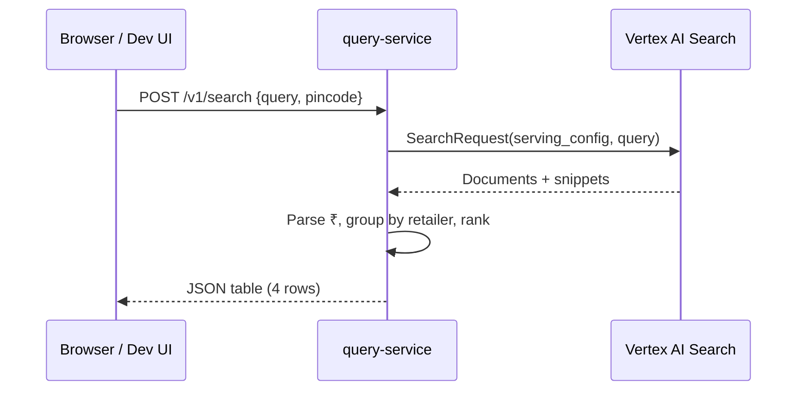

# QuickPickr — Environment Setup (Vertex AI Search)

| Field | Value |
|-------|-------|
| **Date** | 2026-05-19 |
| **Author** | @project.mgr / @system.arch |
| **Status** | Vertex search path documented |

---

## 1. What you already have

If your repo-root `.env` includes:

```bash
VERTEX_SEARCH_SERVING_CONFIG=projects/.../engines/.../servingConfigs/default_search
GOOGLE_APPLICATION_CREDENTIALS=/path/to/service-account.json
```

then the **query service** can call Vertex AI Search directly—no extra API keys beyond GCP credentials.

| Variable | Purpose |
|----------|---------|
| `VERTEX_SEARCH_SERVING_CONFIG` | Full resource name passed to `SearchRequest.serving_config` |
| `GOOGLE_APPLICATION_CREDENTIALS` | Service account JSON with permission to search the engine/data store |

Your engine (`quickpickr_*`) should already index retailer catalog pages. The app sends the **user’s product query** to this serving config and maps hits into the four-retailer comparison table.

---

## 2. Quick verify (CLI)

From the repository root:

```powershell
cd c:\Users\welcome\Documents\quick-pickr-project
python -m venv .venv
.\.venv\Scripts\activate
pip install -r apps\query-service\requirements.txt
python scripts\verify_vertex.py "Amul Gold 500 ml"
```

Expected: a list of indexed hits with titles and parsed ₹ prices.

---

## 3. Run the query API + web search UI

```powershell
cd apps\query-service
$env:PYTHONPATH = "."
uvicorn app.main:app --reload --port 8080
```

| URL | Purpose |
|-----|---------|
| http://127.0.0.1:8080/ | Dev search page (product + pincode) |
| http://127.0.0.1:8080/health | Vertex connectivity check |
| http://127.0.0.1:8080/docs | OpenAPI (Swagger) |

Example API call:

```powershell
curl -X POST http://127.0.0.1:8080/v1/search `
  -H "Content-Type: application/json" `
  -d '{"query":"Amul Gold 500 ml","pincode":"560034"}'
```

---

## 4. How search maps to QuickPickr



**Pincode (v0):** Accepted and stored client-side; filtering by zone requires `zoneId` on indexed documents (see [sad.md](./sad.md) §5.3). Until zone facets exist, all hits come from the global index.

**Indexed fields (recommended):** `retailer`, `title`, `packSize`, `priceInr`, `productUrl`, `imageUrl`, `crawledAt` — improves row quality vs snippet-only parsing.

---

## 5. Troubleshooting

| Symptom | Check |
|---------|--------|
| `403` / `Permission denied` | Service account has **Discovery Engine User** (or Editor) on the project |
| `serving config not found` | Copy full path from GCP Console → AI Applications → your engine → serving config |
| Empty results | Data store indexed? Try a broad query (`milk`) in Console search preview |
| No ₹ in rows | Add `priceInr` to struct data at index time, or ensure snippets contain `₹` |

---

## Sources

- [sad.md](./sad.md) §5–§6
- [prd.md](../1.define/prd.md) §12 API contract
- Repo `apps/query-service/`

---

## Audit

| Timestamp (UTC) | Persona | Action |
|-----------------|---------|--------|
| 2026-05-19T20:00:00Z | @system.arch | Documented Vertex env vars and local query-service run path |
